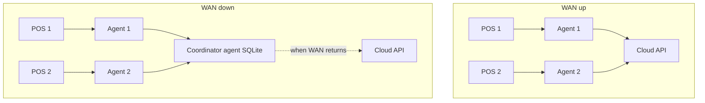

# Phase 6 — Offline sync & LAN coordinator

Planned work after **Phase 4 (cross-venue billing)** close-out. Replaces ad-hoc notes in roadmap threads about peer mesh vs sync.

## Goals

1. **Single-venue resilience** — orders, cheques, cash/card pay work when WAN to cloud API is down (SQLite + `sync_queue` → idempotent hub replay).
2. **Clear cross-venue policy** — no silent partial failure; explicit UI when cross-sell is unavailable.
3. **Optional hub floor coordination** — when multiple anchors/POS terminals share **the same physical tables**, one **designated POS** acts as **LAN coordinator** while cloud is unreachable (star topology, **not** peer mesh).

## Architecture (two modes)

### WAN up (default — today)

```
POS (Electron) → local-agent (:3456) → cloud API (:3000) → PostgreSQL
```

- System of record: **PostgreSQL**.
- Real-time: Socket.IO from cloud (menus, config, metrics).
- Cross-sell: online-only proxy via `apps/local-agent/src/routes/cross-venue.js`.

### WAN down (Phase 6 target)

```
POS → local-agent → LAN coordinator agent (fixed IP, one designated terminal)
                         ↓
                    coordinator SQLite (floor locks, optional group buffer)
                         ↓
                    replay to cloud when WAN returns
```

- **Star topology:** every non-coordinator agent talks to **one** coordinator. **No agent-to-agent peer mesh.**
- Coordinator = **`local-agent` on a designated POS** (or back-office PC running agent only). Electron UI optional on that machine.
- Cloud remains **authoritative for money/audit** after successful replay.



## Why coordinator POS, not peer mesh

| Approach | Verdict |
|----------|---------|
| **Per-anchor sync only** (no shared coordinator) | OK for **isolated** venue tables; **not** OK for shared hub floor (double seating). |
| **Peer mesh** (agents gossip to each other) | Avoid — N×N links, split-brain, hard reconnect merge, poor supportability. |
| **Dedicated LAN edge server** | Best ops; optional when client can deploy a mini PC. |
| **Designated POS as coordinator** | **Chosen fallback** — same star as edge, no extra hardware; one stable “lead” till. |

## LAN coordinator responsibilities (phased)

### Slice A — Failover & floor locks (P0)

- Hub manager designates **coordinator terminal** (Settings → Terminals or env).
- Agents detect cloud health; on failure, route **floor/table** operations to `http://<COORDINATOR_LAN_IP>:3456`.
- **Hub-wide floor table occupancy** (one physical table = one lock), not per-venue `venueId + tableLabel` only.
- POS banner: `Offline — LAN coordinator` / `Cross-sell requires hub or coordinator`.
- Coordinator runs as a **Windows service** where possible (survives Electron close).

### Slice B — Standard offline per terminal (P0)

- Existing `sync_queue` events: order/cheque/pay for **single venue** on local SQLite.
- FIFO replay + `syncId` idempotency to cloud (see `.cursor/skills/offline-sync/SKILL.md`).
- Cached menu + billing matrix on coordinator (read-only while offline).

### Slice C — Cross-sell offline (P1, after A+B)

- Coordinator holds cross-venue **group buffer** (mirror `crossVenueGroupId` + per-venue cheques).
- Anchor POS cross-sell calls coordinator instead of cloud proxy.
- Atomic **group replay** endpoint on cloud (`syncId` / client `groupId`).
- Requires cached **linked venue menus** + **per-venue printer** routes on coordinator.

### Slice D — Hub floor online (can precede or parallel A)

- When WAN up: `floor_table` (hub-scoped) + WebSocket `floor:table_updated` so all POS see same busy/free without LAN coordinator.

## Multi-anchor hubs

- Billing matrix stays **pairwise** (`anchorVenueId → targetVenueId`); multiple anchors are normal.
- Each anchor may run cross-sell into its targets.
- **Shared physical tables** require **one floor lock service** (cloud when online, coordinator when offline) — not peer links between anchors.
- On reconnect, each agent (or coordinator) replays **independent** queues; server dedupes by `syncId`.

## Configuration (planned)

| Setting | Where | Purpose |
|---------|--------|---------|
| `COORDINATOR_TERMINAL_ID` | Hub Settings / agent env | Which terminal is LAN coordinator |
| `COORDINATOR_LAN_HOST` | All agents | Fixed LAN IP/hostname for failover |
| `COORDINATOR_FALLBACK_ENABLED` | All agents | Use coordinator when cloud health fails |
| `CLOUD_HEALTH_URL` | Agent | Probe target (API `/health` or agent upstream) |

v1: **static coordinator** — no leader election. Optional manual backup IP later.

**v1.1 (implemented): dynamic cluster** — agents gossip on LAN (`AGENT_PEERS` + optional mDNS), relay through any peer with WAN, deterministic leader election when all WAN down. Open cheques are **pre-hydrated** into local SQLite every 30s while online so mid-service drops do not lose in-progress tables.

| Setting | Where | Purpose |
|---------|--------|---------|
| `AGENT_LAN_SECRET` | All agents | Shared LAN auth for peer/relay routes |
| `AGENT_PEERS` | All agents | Static fallback peer IPs (comma-separated) |
| `AGENT_PRIORITY` | All agents | Leader election preference (higher wins) |
| `AGENT_LAN_HOST` | Each agent | Advertised LAN IP for gossip (auto-detected if empty) |
| `AGENT_LAN_PORT` | All agents | LAN HTTP port (default 3456) |
| `AGENT_DEVICE_LABEL` | Each agent | Local till display name (hub `Terminal.name` used if empty) |

**Device profile (v1.1):** On startup and each heartbeat while online, agents POST till label, LAN IP/port, priority, and cluster mode to `POST /api/v1/terminals/heartbeat`. Hub stores `lastLanHost`, `lastLanPort`, `lastClusterMode` for **Settings → Terminals**. Gossip includes `deviceLabel` so POS offline banners can name relay/lead peers.

**Shift replay (v1.1):** Offline `SHIFT_OPEN` / `SHIFT_CLOSE` sync events replay to API with `syncId` idempotency; local shift rows link to server ids via `shift-cache.js`.

## Failure modes & ops rules

| Event | Policy (v1) |
|-------|-------------|
| Coordinator PC reboots | Other POS: read-only floor or “no new tables” until coordinator back |
| Cloud flaps (half online) | Prefer **single mode**: all LAN coordinator or all cloud — avoid split-brain |
| Coordinator is also rush till | Acceptable for 2–4 terminals; prefer quiet/back-office lead for 5+ |
| Money while offline | Queued locally; **Postgres wins** after replay |

## Explicit non-goals (Phase 6 v1)

- Full peer-to-peer mesh between agents.
- Mandatory dedicated edge appliance (coordinator POS is the fallback).
- CEO dashboard writes while WAN down.
- Integrated card terminal auth offline (manual card only).

## Related docs

| Doc | Topic |
|-----|--------|
| [TEAM_LOG.md](TEAM_LOG.md) § Roadmap | Phase status & loose ends |
| [PRD.md](PRD.md) Epic 7 | US-7.1–7.5 acceptance criteria |
| [Technical_Proposal.md](Technical_Proposal.md) §6 | Sync queue & offline limits |
| [TechSpec.md](TechSpec.md) | Env vars, sync contracts |
| [PHASE3_SCALABLE_PLAN.md](PHASE3_SCALABLE_PLAN.md) | Deferred items index |
| [AGENTS.md](../AGENTS.md) | Agent entry + Phase 6 pointer |

## Verification (when implemented)

1. Disconnect WAN → standard order + cash pay on non-coordinator POS → reconnect → one server cheque.
2. Disconnect WAN → open Table 5 on anchor A → anchor B sees busy via coordinator.
3. Disconnect WAN → cross-sell disabled or works via coordinator per slice C flag.
4. Replay same `syncId` → no duplicate payment.
