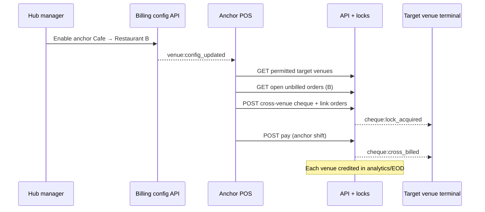

# Team Development Log

Chronological record of what we built, why, and how to verify. **Every developer adds an entry when merging feature work.**

Format for new entries → see [DEVELOPMENT.md](DEVELOPMENT.md#team-process).

---

## Phase 0 — Project foundation (June 2026)

### 2026-06-06 — Documentation & AI setup
**Phase:** 0 (pre-code)  
**Who:** Initial planning  
**What:** Created product and engineering docs for the team and Cursor agents.

**Files:**
- `docs/PRD.md` — user stories (US-1.1 through US-13.x), acceptance criteria
- `docs/Technical_Proposal.md` — architecture, hub-and-spoke, phased delivery
- `docs/TechSpec.md` — naming, WebSocket contracts, security, Docker, CI
- `AGENTS.md` — agent/developer entry point
- `apps/api/prisma/schema.prisma` — DB source of truth
- `.cursor/skills/` — venue-pos, implement-user-story, database-schema, offline-sync, websocket-events

**Verify:** Read `docs/README.md` index.

---

### 2026-06-06 — Monorepo scaffold (apps + packages)
**Phase:** 0.1  
**What:** npm workspaces monorepo with clear separation: deployable apps vs shared packages.

**Structure:**
```
apps/     → api, dashboard, pos, kds, local-agent
packages/ → shared, i18n
```

**Files:**
- Root `package.json` — workspace scripts (`dev:api`, `migrate`, etc.)
- `eslint.config.js`, `.prettierrc`, `.gitignore`
- `packages/shared` — `ROLES`, `ERROR_CODES`, `API_BASE`
- `packages/i18n` — `en.json`, `ar.json`, `getDirection()`

**Verify:**
```bash
npm install
npm run lint:i18n   # → "23 keys in sync"
```

---

### 2026-06-06 — API server foundation (Fastify + Prisma)
**Phase:** 0.2  
**Story:** Foundation for US-1.x auth  
**What:** Node API with Fastify, Prisma ORM, PostgreSQL, structured errors.

**Files:**
- `apps/api/prisma/schema.prisma` — `Venue`, `User`, `Terminal` models
- `apps/api/prisma/migrations/20260606120000_init/` — initial migration
- `apps/api/src/db/prisma.js` — PrismaClient singleton
- `apps/api/src/app.js`, `src/index.js` — Fastify bootstrap
- `apps/api/src/plugins/error-handler.js` — standard error JSON
- `apps/api/src/routes/health.js` — `GET /health`, `GET /health/ready`
- `apps/api/src/config.js` — env loading

**Removed:** Raw `pg` pool + manual SQL migrations (replaced by Prisma).

**Verify:**
```bash
docker compose up -d postgres
npm run migrate
curl http://localhost:3000/health
```

---

### 2026-06-06 — Auth skeleton (JWT RS256)
**Phase:** 0.3  
**Stories:** US-1.1 (manager login), US-1.2 (cashier PIN), US-1.3 (terminal headers)  
**What:** Manager login and cashier PIN auth with terminal validation.

**Endpoints:**
| Method | Path | Purpose |
|--------|------|---------|
| POST | `/api/v1/auth/login` | Manager username/password → JWT |
| POST | `/api/v1/auth/pin` | Cashier PIN + `X-Terminal-ID` + `X-Terminal-Secret` |
| POST | `/api/v1/auth/logout` | 204 no content |

**Files:**
- `apps/api/src/routes/auth.js`
- `apps/api/src/services/auth-service.js`
- `apps/api/src/middleware/auth.js` — `authenticate`, `requireRoles`
- `apps/api/src/utils/jwt.js` — RS256 sign/verify
- `scripts/generate-jwt-keys.mjs` → `ops/secrets/*.pem`
- `apps/api/src/auth.test.js` — health + login tests

**Verify:**
```bash
npm run generate:jwt-keys
npm run seed
npm run dev:api
curl -X POST http://localhost:3000/api/v1/auth/login \
  -H "Content-Type: application/json" \
  -d '{"username":"admin","password":"admin123"}'
```

---

### 2026-06-06 — Database seed (dev data)
**Phase:** 0.2  
**What:** Repeatable dev seed for venue, manager, cashier, terminal.

**Files:** `apps/api/src/db/seed.js`

**Seed data:**
| Entity | Value |
|--------|-------|
| Venue | Demo Cafe (anchor) |
| Manager | `admin` / `admin123` |
| Cashier | PIN `1234` (user `cashier1`) |
| Terminal ID | `00000000-0000-4000-8000-000000000001` |
| Terminal secret | `dev-terminal-secret` |

**Verify:** `npm run seed` then login via dashboard or curl.

---

### 2026-06-06 — Admin dashboard shell
**Phase:** 0.6  
**Stories:** US-11.1, US-11.2 (foundation)  
**What:** React + Vite + Tailwind admin with login, protected routes, EN/AR toggle, RTL.

**Files:**
- `apps/dashboard/src/pages/LoginPage.jsx`
- `apps/dashboard/src/pages/DashboardHome.jsx`
- `apps/dashboard/src/components/Layout.jsx`, `LanguageToggle.jsx`
- `apps/dashboard/src/hooks/useAuth.js`

**Verify:**
```bash
npm run dev:dashboard
# Open http://localhost:5173 — login admin/admin123 — toggle EN/ع
```

---

### 2026-06-06 — POS Electron shell
**Phase:** 0.7  
**What:** Electron + Vite POS with kiosk config, preload IPC bridge to local agent.

**Files:**
- `apps/pos/electron/main.cjs` — BrowserWindow, kiosk flag
- `apps/pos/electron/preload.cjs` — `window.venuePos.getAgentHealth()`
- `apps/pos/src/App.jsx` — agent status display

**Verify:**
```bash
npm run dev:agent
npm run dev:pos
# Or: npm run electron:dev -w @venue-pos/pos
```

---

### 2026-06-06 — KDS shell
**Phase:** 0.8  
**What:** Kitchen display Electron + Vite app with i18n.

**Files:** `apps/kds/src/App.jsx`, `electron/main.cjs`

**Verify:** `npm run dev:kds` → http://localhost:5175

---

### 2026-06-06 — Local agent shell
**Phase:** 0.8  
**Stories:** Foundation for US-7.x offline  
**What:** Fastify on :3456, SQLite WAL, sync_queue table stub, health endpoint.

**Files:**
- `apps/local-agent/src/db/sqlite.js`
- `apps/local-agent/src/server.js`
- `apps/local-agent/src/index.js`

**Verify:**
```bash
npm run dev:agent
curl http://127.0.0.1:3456/health
```

---

### 2026-06-06 — Docker & CI
**Phase:** 0.4, 0.5  
**What:** Local Postgres/Redis compose; API Dockerfile with Prisma migrate; GitHub Actions CI.

**Files:**
- `docker-compose.yml`, `docker-compose.dev.yml`
- `docker/Dockerfile.api`
- `ops/nginx/nginx.conf`
- `.github/workflows/ci.yml` — lint → api test (postgres service) → build frontends

**Verify:**
```bash
docker compose up -d postgres redis
npm run migrate && npm run test -w @venue-pos/api
npm run build:dashboard && npm run build:pos && npm run build:kds
```

---

### 2026-06-06 — Cursor rules & team docs (this entry)
**Phase:** 0  
**What:** Expanded Cursor rules for each tech layer; team documentation for onboarding.

**Files:**
- `.cursor/rules/` — core, team-workflow, monorepo, prisma, api-server, i18n-rtl, shared-packages, docker-ci, react-ui, electron-terminal
- `docs/README.md`, `docs/DEVELOPMENT.md`, `docs/TEAM_LOG.md`

**Verify:** New teammate follows `docs/DEVELOPMENT.md` from zero to running apps.

---

### 2026-06-06 — Documentation cleanup
**Phase:** 0  
**What:** Removed redundant spec files; consolidated docs and Cursor rules for a lean set.

**Removed:**
- `.cursor/PROJECT_SPEC.md` (duplicated TechSpec + Prisma schema)
- `.cursor/IMPLEMENTATION_PLAN.md` (duplicated TEAM_LOG + Technical_Proposal)
- `docs/REPO_STRUCTURE.md` (merged into DEVELOPMENT.md)
- `.cursor/skills/*/reference.md` (duplicated TechSpec §8 + outdated SQL)
- `.cursor/rules/README.md`, `fastify-api.mdc`, `database.mdc` (merged into api-server + prisma rules)

**Source of truth now:**
- DB → `apps/api/prisma/schema.prisma`
- WebSocket payloads → `docs/TechSpec.md` §8
- Roadmap → `docs/TEAM_LOG.md` + `docs/Technical_Proposal.md` §12
- Setup → `docs/DEVELOPMENT.md`

---

### 2026-06-06 — Phase 1 core slice: menu + POS order flow
**Phase:** 1  
**Stories:** US-2.1–2.3 (foundation), US-2.5 (publish), US-3.1–3.2 (foundation)  
**What:** Menu templates with categories/items, manager write + terminal read APIs, local-agent menu cache, POS menu grid with draft order creation.

**Schema:** `MenuTemplate`, `MenuTemplateVenue`, `Category`, `MenuItem`, `Order`, `OrderItem`  
**Migration:** `20260606130000_phase1_menu_orders`

**API endpoints:**
| Method | Path | Purpose |
|--------|------|---------|
| GET/POST | `/api/v1/menu-templates` | List / create templates |
| GET/PATCH | `/api/v1/menu-templates/:id` | Read / update template |
| POST | `/api/v1/menu-templates/:id/categories` | Add category |
| POST | `/api/v1/categories/:id/items` | Add menu item |
| POST | `/api/v1/menu-templates/:id/publish` | Publish menu + version hash |
| GET | `/api/v1/venues/:venueId/menu` | Terminal: published menu |
| POST | `/api/v1/orders` | Terminal: create draft order |
| POST | `/api/v1/orders/:id/items` | Terminal: add item to order |

**Local agent:** `GET /v1/menu`, `POST /v1/menu/sync`, `POST /v1/orders`, `POST /v1/orders/:id/items`  
**POS:** Category tabs, item grid, cart sidebar, new-order flow via IPC  
**Seed:** Demo Lunch Menu (published) for Demo Cafe

**Verify:**
```bash
nvm use 20.20.2
docker compose up -d postgres redis
npm run migrate && npm run seed
npm run test -w @venue-pos/api
npm run dev:api & npm run dev:agent & npm run dev:pos
# POS: New order → tap items → see cart total
```

**Dev IDs (after seed):**
| Entity | ID |
|--------|-----|
| Venue | `00000000-0000-4000-8000-000000000010` |
| Cashier | use `cashier1` row id from DB (see seed output) |

---

### 2026-06-06 — Phase 1 complete: modifiers, kitchen send, dashboard menu manager
**Phase:** 1  
**Stories:** US-2.4, US-2.5, US-3.2–3.3 (foundation), US-1.2 (PIN on POS)  
**What:** Modifier groups with order-time snapshots, Socket.IO `menu:updated` + `order:created`, full order lifecycle (qty, remove, send, receipt), dashboard menu manager, POS PIN login + modifier modal, local-agent sync replay + WS menu listener.

**Migration:** `20260606140000_phase1_modifiers_kitchen` (ModifierGroup, ModifierOption, MenuItemModifier, Order.sentAt, OrderItem.modifiersSnapshot)

**Additional API endpoints:**
| Method | Path | Purpose |
|--------|------|---------|
| GET | `/api/v1/venues` | List venues (dashboard) |
| PUT | `/api/v1/menu-templates/:id/categories/reorder` | Reorder categories |
| POST | `/api/v1/menu-templates/:id/modifier-groups` | Create modifier group |
| PATCH | `/api/v1/menu-items/:itemId` | Update item / 86 toggle |
| PATCH | `/api/v1/orders/:id/items/:itemId` | Update item quantity |
| DELETE | `/api/v1/orders/:id/items/:itemId` | Remove draft item |
| POST | `/api/v1/orders/:id/send` | Send order to kitchen |
| GET | `/api/v1/orders/:id/receipt` | Basic receipt text |

**Local agent:** `POST /v1/sync/replay`, `PATCH/DELETE /v1/orders/:id/items/:itemId`, `POST /v1/orders/:id/send`, `GET /v1/orders/:id/receipt`  
**Dashboard:** `MenuManagerPage` — templates, categories, items, publish, 86 toggle  
**POS:** PIN login, modifier modal, cart qty +/-, send kitchen, receipt display  
**Tests:** `phase1.test.js` (12 API tests total) + `scripts/phase1-scenarios.mjs` (integration smoke)

**Verify:**
```bash
nvm use 20.20.2
docker compose up -d postgres redis
npm run migrate && npm run seed
npm run lint && npm run lint:i18n && npm run test -w @venue-pos/api
npm run dev:api & npm run dev:agent & npm run dev:dashboard & npm run dev:pos
node scripts/phase1-scenarios.mjs   # with API + agent running
```

**Dev credentials (after seed):**
| Entity | Value |
|--------|-------|
| Manager | `admin` / `admin123` |
| Cashier PIN | `1234` |
| Cashier ID | `00000000-0000-4000-8000-000000000011` |
| Venue ID | `00000000-0000-4000-8000-000000000010` |
| Terminal ID | `00000000-0000-4000-8000-000000000001` |
| Terminal secret | `dev-terminal-secret` |

**Deferred to Phase 2+:** KDS `order:created` UI, kitchen printer, category drag-and-drop UI, full offline conflict resolution (Phase 6).

---

### 2026-06-06 — Docs: KDS optional at onboarding + cleanup
**Phase:** 1 (docs)  
**What:** Documented `kds_enabled` / `FEATURE_KDS_ENABLED` — KDS is a provider onboarding toggle, not required for every hub (printer-only OK). Cleaned stale roadmap/audit/Electron references across `DEVELOPMENT.md`, `README.md`, `AGENTS.md`, `PRD.md`, `TEAM_LOG.md`.

**Verify:** Read `docs/DEVELOPMENT.md` § Optional features (provider onboarding).

---

### 2026-06-06 — CI fix: Prisma generate without DB + Electron Node 20
**Phase:** 1 (tooling)  
**What:** CI `npm ci` failed — `prisma.config.ts` required `DATABASE_URL` at install time; `electron@42` requires Node ≥22 while CI/dev use Node 20.

**Fix:** Removed `datasource` from `prisma.config.ts`; dummy `DATABASE_URL` in `prisma-generate.mjs` for generate-only; Electron `^40.10.2` (Node 20 + audit clean).

**Verify:** `DATABASE_URL= npm ci` on lint job path; `npm audit` → 0 vulnerabilities.

---

### 2026-06-06 — Install/audit/Prisma team docs
**Phase:** 1 (tooling)  
**What:** Clarified npm audit highs (Electron + tar, not Prisma), migrated to `prisma.config.ts`, pinned `tar` override, upgraded Electron, made `prisma-generate` retry-only on failure.

**Files:** `apps/api/prisma.config.ts`, `scripts/prisma-generate.mjs`, root `package.json` overrides, `apps/pos/package.json`, `docs/DEVELOPMENT.md`

**Also:** `bcrypt@6` (drops vulnerable `tar` chain), Electron `^40.10.2` in POS + KDS (Node 20).

**Verify:** `npm install` → `found 0 vulnerabilities`; no `package.json#prisma` warn; `npm run db:generate` quiet unless EPERM retry on Z:.

---

### 2026-06-06 — PR #1 review fixes (Phase 1 hardening)
**Phase:** 1 (bugfix)  
**What:** Addressed valid Copilot review comments from PR #1 — Socket.IO decoration, sync queue enqueue-on-failure only, qty replay, smoke script guards, POS `lang` on load.

**Files:**
- `apps/api/src/app.js` — `app.decorate('io', null)` so encapsulated routes see `request.server.io`
- `apps/local-agent/src/services/orders.js` — removed eager `enqueueSync` from local writes
- `apps/local-agent/src/server.js` — enqueue only when immediate API sync fails; `order.patch_item` on qty failure
- `apps/local-agent/src/services/sync-processor.js` — replay handler for `order.patch_item`
- `apps/pos/src/i18n.js` — set `<html lang>` on initial load
- `scripts/phase1-scenarios.mjs` — skip order scenarios when menu/order prerequisites missing

**Verify:**
```bash
npm run lint && npm run test -w @venue-pos/api && npm run test -w @venue-pos/local-agent
npm run dev:api & npm run dev:agent
node scripts/phase1-scenarios.mjs
```

---

### 2026-06-06 — Fix local-agent sync queue false success
**Phase:** 1 (bugfix)  
**What:** `fetch()` does not throw on HTTP 4xx/5xx. Sync replay was marking queue jobs `done` even when the API rejected them, so failed orders could disappear from the retry queue.

**Files:**
- `apps/local-agent/src/services/api-fetch.js` — shared helper with `res.ok` check
- `apps/local-agent/src/services/sync-processor.js` — uses `apiFetch`; only marks `done` on success
- `apps/local-agent/src/services/orders.js` — imports shared `apiFetch`
- `apps/local-agent/src/server.js` — add-item inline fetch uses `apiFetch`
- `apps/local-agent/src/services/sync-processor.test.js` — failure keeps `pending` + increments `retry_count`

**Verify:**
```bash
npm run test -w @venue-pos/local-agent
npm run dev:agent   # stop API, create order on POS, confirm sync_queue stays pending
```

---

## Phase 2 — In progress (`phase-2` branch)

Kitchen output — **KDS is optional per client** (`kds_enabled` at provider onboarding). Printer-only sites skip `apps/kds`; still deliver send-to-kitchen, printer, and status APIs.

### 2026-06-06 — US-6.1 KDS order display (started)

**What:** `GET /api/v1/kitchen/orders`, KDS socket joins `venue:{id}:kitchen` via `clientType: 'kds'`, live `order:created` tickets in `apps/kds` with age color coding. Gated by `FEATURE_KDS_ENABLED` / `VITE_FEATURE_KDS_ENABLED`.

**Files:** `apps/api/src/routes/kitchen.js`, `apps/api/src/services/order-service.js`, `apps/api/src/plugins/socket.js`, `apps/kds/src/App.jsx`, `packages/i18n/locales/*.json`

**Verify:**
```bash
npm run dev -- --kds
# POS: checkout an order → ticket appears on http://localhost:5175
npm run test -w @venue-pos/api
```

### 2026-06-06 — US-6.2 / US-3.4 kitchen item status (started)

**What:** `OrderItem.kitchenStatus` enum, `PATCH /api/v1/kitchen/orders/:id/items/:itemId/status`, auto order status (`sent` → `partially_ready` → `ready` → `served`), `order:item_status` WebSocket to POS + KDS. KDS Start/Ready/Bump buttons; POS kitchen progress bar after checkout.

**Migration:** `20260606150000_phase2_item_kitchen_status`

**Verify:**
```bash
npm run migrate -w @venue-pos/api
npm run dev -- --kds
# POS checkout → KDS Start/Ready/Bump → POS footer updates live
```

### 2026-06-06 — POS Clear (start over) — US-3.5 void removed from cashier UI

**What:** Draft cart **Clear** abandons the order (`POST /api/v1/orders/:id/abandon`) — no manager PIN. Removes orphan drafts locally + on server. Matches real F&B: fix mistakes with **−** or start over with **Clear** while building the tab.

**Removed from POS:** Void button/modal (did not match open-cheque workflow). Backend `void` API + audit schema kept for Phase 3 cheque management.

**Verify:**
```bash
npm run test -w @venue-pos/api
# POS: add items → Clear → empty cart, fresh order
```

### 2026-06-06 — US-6.3 kitchen printer

**What:** Local agent prints ESC/POS text ticket on send when `KITCHEN_PRINTER_HOST` is set (TCP port 9100, 3 retries). `/health` exposes `printer` status; POS footer shows printer connected/offline from agent health.

**Env:** `apps/local-agent/.env` — `KITCHEN_PRINTER_HOST`, `KITCHEN_PRINTER_PORT` (see `.env.example`)

**Verify:**
```bash
# Without printer host: health shows not_configured, POS shows connected
# With host: send order → ticket prints; failed host → printer offline in POS
```

**Remaining Phase 2 (nice-to-have):**
- SLA alerts, station grouping, KDS undo
- Venue-level printer config in dashboard

### Deferred — Phase 3 open cheque / tab management (real F&B model)

Reference: Toast, Square, Lightspeed, Oracle Simphony — **open check** per table/guest.

| Today (Phase 1–2) | Target (Phase 3+) |
|-------------------|-------------------|
| Checkout sends to kitchen then **starts a new order** | **Fire** new items to kitchen; **same cheque stays open** |
| One-shot order session | Guest stays hours; add rounds whenever |
| No cheque entity in POS | `cheques` table: open → paid / voided |
| Void on draft cart | **Clear** only on draft; manager void/comp on **running or paid cheques** |

**Phase 3 scope:** See **Phase 3 — In progress** below. Slice 1–4 shipped on `phase-3`; bill split (US-3.6), transfers, shifts, refunds still deferred.

---

## Phase 3 — Closed (`phase-3` branch → PR to `main`)

Open cheques / tabs + payments (see deferred scope above). Branch created from `phase-2`; merge PR #2 to `main` when ready, then rebase `phase-3` on `main` if needed.

**First slice (planned):**
1. `cheques` + `cheque_orders` schema + migration
2. API: open cheque, list open by venue/table, attach orders
3. POS: open/resume table cheque; **Fire** keeps same cheque open
4. Pay cheque (cash) → close
5. Dashboard: open cheques + manager void/comp (web)

### 2026-06-07 — Open cheque model (API + POS slice 1)

**What:** Real tab/cheque lifecycle — one open cheque per table, multiple kitchen rounds, cash pay to close.

**Schema:** `Cheque`, `ChequeOrder`, `Payment` + enums `ChequeStatus`, `PaymentMethod`. Migration `20260607120000_phase3_cheques`.

**API** (`apps/api/src/services/cheque-service.js`, `routes/cheques.js`):
- `POST /api/v1/cheques/open` — open or resume by `tableLabel`
- `GET /api/v1/cheques/open` — list open cheques for venue
- `GET /api/v1/cheques/:id` — detail + running total
- `POST /api/v1/cheques/:id/fire` — send draft round, spawn new draft on same cheque
- `POST /api/v1/cheques/:id/clear` — abandon current draft round
- `POST /api/v1/cheques/:id/pay` — cash (or card/voucher) closes cheque; sent orders → `closed`

**POS:** Opens cheque on load / table change; **Fire to kitchen** calls cheque fire (stays on same cheque); **Pay cash** when fired total > 0 and draft empty. Receipt panel shows cheque # + cheque total.

**Agent:** Proxies `/v1/cheques/*` to API; prints kitchen ticket on fire.

**Verify:**
```bash
npm run migrate
npm run test
# POS: add items → Fire twice → Pay cash → new cheque for same table
```

**Still deferred:** Bill split (US-3.6), line transfer, integrated card terminal, vouchers, refunds, cross-venue.

### 2026-06-07 — Payments slice (split pay + receipt)

**What:** US-5.1/US-5.4 partial — cash with change, split cash+card, cheque receipt text + auto-print on pay.

**API:**
- `payCheque` accepts `payments[]` (1–5 lines); sum must equal cheque total
- `tendered` for cash change on receipt
- Returns `{ cheque, receipt, change }`
- `GET /api/v1/cheques/:id/receipt`

**POS:** Pay modal — Cash (tender + change) or Split (cash + card amounts).

**Agent:** Prints customer receipt on pay when printer configured.

### 2026-06-07 — Dashboard open cheques + manager void (slice 2)

**What:** Managers view open tabs and void kitchen rounds or entire cheques from the web dashboard (manager PIN + audit).

**API** (`routes/manager-cheques.js`, `cheque-service.js`):
- `GET /api/v1/manager/cheques/open` — JWT; hub manager optional `?venueId=`
- `GET /api/v1/manager/cheques/:id`
- `POST /api/v1/manager/cheques/:id/orders/:orderId/void` — void one round (`sent`…`served`)
- `POST /api/v1/manager/cheques/:id/void` — void entire open cheque → `ChequeStatus.voided`
- Emits `order:voided` to KDS/POS when applicable

**Dashboard:** `/cheques` — open list, running total, per-round void, void entire cheque modal (PIN + reason).

**Verify:**
```bash
npm run test
# Dashboard: admin / admin123 → Open cheques → void round (manager PIN 9999)
```

### 2026-06-06 — KDS feature-flag hardening (PR #2 review)

**What:** KDS shows `kds.disabled` on API 403 (env mismatch). Socket rejects `clientType: 'kds'` when `FEATURE_KDS_ENABLED=false`; kitchen WS emits (`order:created`, `order:item_status`, `order:voided`) skipped when KDS off.

### 2026-06-06 — POS label: Checkout → Fire to kitchen

**What:** POS primary action uses `pos.sendKitchen` (“Fire to kitchen” / “إرسال للمطبخ”) instead of “Checkout” — avoids implying payment; real checkout comes with Phase 3 cheques.

### 2026-06-08 — Comp, paid history, POS open-tab browser (slice 4)

**Stories:** US-3.5 (manager comp on running cheque), US-5.1 (pay closes orders)

**What:** Manager comps individual fired line items (excluded from total/receipt); pay sets kitchen orders to `closed`; dashboard Open/Paid tabs; POS horizontal open-cheque picker.

**Schema:** `OrderItem.isComped`, `OrderItemCompAudit`. Migration `20260608120000_phase3_item_comp`.

**API:**
- `GET /api/v1/manager/cheques?status=open|paid|voided` — paid history (newest first)
- `POST /api/v1/manager/cheques/:id/orders/:orderId/items/:itemId/comp` — manager PIN + reason + audit
- `payCheque` — billable orders → `closed` (not `billed`)
- Paid cheque `total` from payment sum; comped lines show `[COMP]` on receipt

**Dashboard:** `/cheques` — Open / Paid tabs, per-line **Comp**, payments on paid detail.

**POS:** Chip row of open tables (`GET /v1/cheques/open`) — tap to resume another tab.

**Verify:**
```bash
npm run migrate
npm run test
npm run lint:i18n
# Dashboard: Open tab → Comp line (PIN 9999) → total drops
# Dashboard: Paid tab after POS pay
# POS: two tables open → switch via chips
```

**Still deferred:** Bill split (US-3.6), line transfer, shifts (US-13.1), refunds (US-5.6), cross-venue (Epic 4), receipt PDF.

### 2026-06-09 — Bill split by item (US-3.6 slice 5)

**What:** Split open cheque into sub-cheques by assigning fired line items; each sub-cheque paid independently; parent auto-closes when all splits (and remainder) are paid.

**Schema:** `Cheque.parentChequeId`, `Cheque.splitLabel`, `OrderItem.billingChequeId`, `OrderItem.paidAt`. Migration `20260609120000_phase3_cheque_split`.

**API:**
- `POST /api/v1/cheques/:id/split` — `{ splits: [{ label, itemIds }] }` (1–8 splits)
- Pay on child marks items `paidAt`; parent finalizes when all children + remainder settled
- `serializeCheque` includes `childCheques`, `parentCheque`, filtered item totals

**POS:** Split bill modal (Guest 1 / Guest 2 item checkboxes); sub-cheques in open-tab chips.

**Dashboard:** Sub-cheques list on parent detail; split label in open/paid lists.

**Verify:**
```bash
npm run migrate
npm run test
# POS: fire 2 rounds → Split bill → pay each guest chip
```

**Still deferred:** Split by seat, split by custom amount, line transfer, shifts, refunds, cross-venue, receipt PDF.

### 2026-06-09 — Structure refactor (agent routes, POS components, cheque services)

**What:** No behavior change — reorganized bloated files to match `.cursor/rules` and dashboard patterns.

**local-agent:** `server.js` → thin bootstrap; routes in `src/routes/{health,menu,sync,orders,cheques}.js`.

**POS:** `App.jsx` ~200 lines wiring; `api/agent.js`, `hooks/*`, `components/*`, `utils/*`.

**API:** `cheque-service.js` barrel; logic split into `cheque-shared.js`, `cheque-lifecycle.js`, `cheque-pay.js`, `cheque-split.js`, `cheque-manager.js`.

**Verify:** `npm run test` + `npm run lint:i18n` — all green.

### 2026-06-10 — Shift open/close (US-13.1 / US-13.2 slice 6)

**What:** Cashier declares opening float, payments link to active shift, close shift reconciles cash with over/short + manager PIN when above threshold.

**Schema:** `Shift`, `ShiftEvent`, `Payment.shiftId`. Migration `20260610120000_phase3_shifts`.

**API** (`shift-service.js`, `routes/shifts.js`):
- `GET /api/v1/shifts/active?cashierId=`
- `POST /api/v1/shifts/open` — one open shift per cashier
- `POST /api/v1/shifts/close` — expected cash = open float + cash payments; manager PIN if |over/short| > 50 EGP
- `payCheque` requires active shift on terminal; links `shiftId` on payments

**POS:** Blocking open-shift modal on load; header shift badge → close modal with reconciliation.

**Agent:** Proxies `/v1/shifts/*`.

**Verify:**
```bash
npm run migrate
npm run test -w @venue-pos/api
npm run lint:i18n
# POS: open shift (float) → pay cheque → close shift (counted cash)
```

**Still deferred:** Split by seat, split by custom amount, line transfer, refunds, cross-venue, receipt PDF.

### 2026-06-11 — Manual card payment + provider flag (US-5.3 slice 7)

**What:** External-terminal card recording with optional last-4, manager PIN above threshold, provider deploy toggle.

**Provider flag:** `FEATURE_MANUAL_CARD_PAYMENT=true|false` (default **OFF**). POS reads `GET /api/v1/features` via agent — card tab hidden when OFF.

**Schema:** `Payment.cardLast4`. Migration `20260611120000_phase3_manual_card`.

**API** (`payment-policy.js`, `routes/features.js`):
- `GET /api/v1/features` — `manualCardPayment`, `manualCardApprovalThreshold`, `kdsEnabled`
- `payCheque` — rejects card when flag OFF; manager PIN when card total ≥ `MANUAL_CARD_APPROVAL_THRESHOLD` (default 500 EGP)
- Receipt shows `card ****1234` when last-4 stored

**POS:** Pay modal — Cash | Card (manual) | Split when enabled; manual-entry banner + optional last-4.

**Verify:**
```bash
# In apps/api/.env for local dev:
FEATURE_MANUAL_CARD_PAYMENT=true
npm run migrate
npm run test -w @venue-pos/api
npm run lint:i18n
```

**Still deferred:** Split by seat, refunds, cross-venue, receipt PDF, integrated terminal (US-5.2). See `docs/PHASE3_SCALABLE_PLAN.md`.

### 2026-06-12 — Line transfer + split by amount (slice 8)

**What:** Move fired lines between tables (provider flag); split cheque by arbitrary dollar amounts.

**Provider flag:** `FEATURE_LINE_TRANSFER=true|false` (default OFF). POS `lineTransfer` from `/api/v1/features`.

**Schema:** `Cheque.splitAmount`, `ChequeItemTransferAudit`. Migration `20260612120000_phase3_transfer_amount`.

**API:**
- `POST /api/v1/cheques/:id/transfer` — manager PIN, audit log
- `POST /api/v1/cheques/:id/split-amount` — `{ splits: [{ label, amount }] }`
- `GET /api/v1/manager/cheques/transfers` — GM/manager audit list

**POS:** Transfer modal (flagged); split-by-amount modal; pay amount-split child chips.

**Scalable plan:** `docs/PHASE3_SCALABLE_PLAN.md` — seat split, integrated PDQ, post-payment GM refunds (deferred).

**Verify:**
```bash
FEATURE_LINE_TRANSFER=true
npm run migrate
npm run test -w @venue-pos/api
```

---

## Slice 9 — Discounts, receipt print, refunds (US-5.6)

**What:** Cheque-level discounts (amount or %), auto customer receipt on checkout via agent, post-payment refunds with audit.

**Schema:** `Cheque.discountAmount`, `ChequeDiscountAudit`, `Refund` (+ shift cash impact).

**API:** `GET /api/v1/features` — `discounts`, `refunds`, `autoReceiptPrint`. Direct apply endpoints in slice 10.

**Flags (default ON):** `FEATURE_DISCOUNTS_ENABLED`, `FEATURE_REFUNDS_ENABLED`, `FEATURE_AUTO_RECEIPT_PRINT`

**POS:** Receipt shows discount line; agent prints on pay when printer configured.

**Seed:** `venue_mgr` PIN `7777` (restaurant manager); `admin` / `9999` (hub manager).

**Verify:**
```bash
npm run migrate
npm run test -w @venue-pos/api
```

---

## Slice 9b — GM approval queue (superseded by slice 10)

**Historical:** Restaurant manager requested → GM approved on `/approvals`. Replaced by venue-manager direct apply + Activity log.

---

## Slice 10 — Venue manager authority + Phase 3 close

**What:** Venue manager executes all sensitive cheque actions; GM reviews audit feed (no approval queue).

**API:**
- `POST /api/v1/cheques/:id/discount` · `POST .../refund` (terminal + venue manager PIN)
- `POST /api/v1/manager/cheques/:id/discount` · `.../refund` (venue_manager JWT)
- `GET /api/v1/manager/activity` — unified audit (hub_manager)
- `GET /api/v1/cheques/paid` — POS paid-cheque picker
- Void/comp/transfer — `venue_manager` PIN only; paid void/comp triggers partial refund

**Socket:** `manager:action` on POS (replaces approval poll).

**Dashboard:** `/activity` replaces `/approvals`; ChequesPage refactored into components + `useChequeManager`.

**POS:** Direct discount apply; refund paid cheque flow; `useManagerSocket`.

**Verify:**
```bash
npm run test -w @venue-pos/api
npm run lint && npm run lint:i18n
```

---

## Phase 3 — closed

**Shipped (slices 1–10):** Open cheques, fire/pay, split item + amount, line transfer, shifts, manual card, comp/void, discounts, refunds, receipt print, venue-manager authority, Activity log, POS refund UI, paid void/comp, socket updates, dashboard cheques refactor.

**Deferred (post–Phase 3):** Seat split, vouchers, integrated PDQ, receipt PDF, cross-venue (Epic 4), offline sync (Phase 6). See `docs/PHASE3_SCALABLE_PLAN.md`.

**Next phase:** Phase 5 — dashboard revenue analytics (GM / hub owner view).

---

## Phase 5 — Epic 8 admin dashboard (`Phase-5` branch)

### 2026-06-07 — US-8.1 Live sales overview (slice 1)

**Story:** US-8.1  
**What:** Hub/venue manager live metrics — revenue today, active kitchen orders, orders/min, open-table heat map. REST snapshot + `dashboard:metrics_tick` every 60s.

**API** (`metrics-service.js`, `routes/manager-metrics.js`, `plugins/metrics-ticker.js`):
- `GET /api/v1/manager/metrics/live` — hub_manager (all venues) or venue_manager (own venue)
- WebSocket `dashboard:metrics_tick` → `dashboard:hub_manager` + per-venue rooms

**Dashboard:** `DashboardHome` — KPI cards, per-venue open-table heat map, live socket updates via `useMetricsSocket`.

**Verify:**
```bash
npm run migrate && npm run test -w @venue-pos/api
npm run lint:i18n
npm run dev:api & npm run dev:dashboard
# Login admin/admin123 → home shows live KPIs; pay a cheque on POS → revenue updates within 60s
```

**Deferred (Phase 5 slice 2+):** US-8.2 revenue analytics charts, US-8.3 order explorer.

---

### 2026-06-07 — US-8.2 Revenue analytics (slice 2)

**Story:** US-8.2  
**What:** Revenue analytics with period presets, venue/category/item drill-down, period comparison, Recharts bar chart, CSV export.

**API** (`analytics-service.js`, `routes/manager-analytics.js`):
- `GET /api/v1/manager/analytics/revenue?preset=&venueId=&categoryId=&format=csv`
- Presets: today, yesterday, week, last_week, month, last_month, custom
- Net revenue from payments minus refunds; category/item breakdown from paid cheques

**Dashboard:** `/analytics` — preset buttons (incl. **custom range** with start/end date pickers), venue filter (hub), KPI + comparison, bar chart, category/item tables, CSV export.

**Verify:**
```bash
npm run test -w @venue-pos/api
npm run lint && npm run lint:i18n
npm run dev:dashboard
# Login admin/admin123 → Analytics → switch presets; pick venue → drill category → Export CSV
```

**Deferred (Phase 5 slice 3):** US-8.3 order explorer.

---

### 2026-06-07 — US-8.3 Order explorer (slice 3)

**Story:** US-8.3  
**What:** Searchable order explorer with filters, pagination (50/page), drill-down detail, void reason, split-cheque linkage, receipt reprint, CSV export.

**API** (`order-explorer-service.js`, `routes/manager-orders.js`):
- `GET /api/v1/manager/orders` — search/filter + `format=csv`
- `GET /api/v1/manager/orders/:id` — line items, modifiers, payments, void audit, cheque splits
- `GET /api/v1/manager/orders/:id/receipt` — reprint order receipt
- `GET /api/v1/manager/cheques/:id/receipt` — reprint cheque receipt (manager auth)

**Dashboard:** `/orders` — **venue_manager only** (hidden from hub admin nav). Cheques grouped by shift → cheques → orders; cheque # search; detail shows all rounds on a tab.

**Verify:**
```bash
npm run test -w @venue-pos/api
npm run lint && npm run lint:i18n
npm run dev:dashboard
# Login as venue_manager → Orders tab visible; cheques nested under shifts
# Login admin/admin123 → no Orders tab (hub uses Analytics, Cheques, Activity)
```

**Note:** Cross-venue cheque linkage deferred with Phase 4; split parent/child cheques shown instead.

---

### 2026-06-07 — US-8.4 Menu Manager polish (slice 4)

**Story:** US-8.4  
**What:** Full menu manager UX — template edit, drag-drop category reorder, bilingual item editor, missing-translation badges, publish confirmation, POS preview, CSV import/export, suggest-Arabic review flow.

**API** (`menu-translations.js`, `routes/menus.js`):
- `GET /api/v1/menu-templates/:id/translations/export` — CSV download
- `POST .../translations/import` — bulk update from CSV
- `GET .../translations/suggest` — missing Arabic names with EN copy as draft
- `POST .../translations/apply` — batch apply reviewed translations
- Optional `nameAr` on create (draft menus may omit Arabic until review)

**Dashboard:** `/menus` refactored — `useMenuManager`, bilingual fields, category drag reorder, item modal, publish confirm, POS preview modal, translation tools.

**Verify:**
```bash
npm run test -w @venue-pos/api
npm run lint:i18n
npm run dev:dashboard
# Login admin/admin123 → Menus → edit template, drag categories, add item (EN+AR), Preview, Suggest Arabic, Export/Import CSV, Publish (confirm)
```

**Deferred:** External auto-translate API (suggest copies EN for manager review); item drag reorder within category.

---

### 2026-06-07 — POS table switch UX (read-only header + modal)
**Phase:** 5 · **Story:** POS polish (table navigation)
**What:** Replaced editable table input with read-only header badge + Tables modal; smart rename for empty cheques; confirm when leaving table with items; receipt chip row for parent tables only.
**Files:** `apps/api/src/services/cheque-lifecycle.js`, `routes/cheques.js`, `apps/local-agent/src/routes/cheques.js`, `apps/pos/src/hooks/useChequeSession.js`, `App.jsx`, `PosHeader.jsx`, `TableSwitchModal.jsx`, `ReceiptPanel.jsx`, `preload.cjs`, `packages/i18n/locales/{en,ar}.json`
**Verify:**
```bash
npm run test -w @venue-pos/api
npm run dev:pos
# Header shows table badge + open count → Tables opens grid modal
# Empty table rename via new table name; confirm strip when switching with draft/fired items
```
**Notes:** `DELETE /api/v1/cheques/:id` removes empty open tables (no fired items, no draft lines). Table rename removed — opening a new label always creates/resumes that table.

---

### 2026-06-07 — Dashboard nav, Activity log UX, shared auth

**What:** Header tab navigation (blue bar); Activity page filter chips, day groups, structured cards; `AuthProvider` fixes logout (shared session state).

**Files:** `apps/dashboard/src/components/DashboardNav.jsx`, `Layout.jsx`, `pages/ActivityPage.jsx`, `hooks/useAuth.js`, `main.jsx`, `packages/i18n/locales/{en,ar}.json`

**Verify:** Login admin → tabs in header; Activity filters work; Logout returns to login.

---

### 2026-06-07 — Order explorer: cheque + shift grouping (US-8.3 polish)

**What:** Venue-manager order explorer groups **cheques by shift**, each cheque lists all order rounds. Cheque # filter/search; detail panel shows every order on the tab.

**API** (`order-explorer-service.js`):
- `GET /api/v1/manager/orders?groupBy=shift` (default for dashboard)
- `GET /api/v1/manager/orders?groupBy=cheque`
- `GET /api/v1/manager/orders/by-cheque/:id` — all rounds + line items
- Shift assignment: payment `shiftId`, else cashier/terminal time match

**Dashboard:** Orders nav **venue_manager only** — not shown to hub_manager (admin).

**Verify:**
```bash
npm run test -w @venue-pos/api
npm run dev:dashboard
# venue_manager login → Orders → shifts contain cheques; click cheque for detail
# admin login → no Orders tab
```

---

### 2026-06-07 — Refund approval workflow (venue request → hub approve)
**Phase:** 5 · **Story:** US-5.6 / manager authority
**What:** Venue managers request refunds (POS + dashboard); hub manager approves/rejects on Approvals page or force-refunds from Cheques. Uses `ManagerApprovalRequest` queue.
**Files:** `approval-request-service.js`, `manager-approvals.js`, dashboard `ApprovalsPage`, POS/dashboard cheque UI, i18n
**Verify:**
```bash
npm run test -w @venue-pos/api
npm run dev:dashboard
# venue_mgr → Cheques → paid tab → Request refund
# admin → Approvals → Approve, or Cheques → Force refund
# POS → Refund paid cheque → venue PIN → hub approves
```

---

### 2026-06-07 — US-8.9 Shift management dashboard (slice 1)
**Phase:** 5 · **Story:** US-8.9
**What:** Manager shift list/detail API, CSV export, force-close, dashboard Shifts page with filters and cash report panel.
**Files:** `apps/api/src/services/manager-shift-service.js`, `apps/api/src/routes/manager-shifts.js`, `apps/api/src/services/shift-service.js` (`forceCloseShiftById`), `apps/dashboard/src/pages/ShiftsPage.jsx`, nav/routes, i18n
**Verify:**
```bash
npm run test -w @venue-pos/api
npm run lint:i18n
npm run dev:dashboard
# hub or venue_manager → Shifts → filter, detail, CSV, force-close open shift (manager PIN)
```
**Notes:** EOD reconciliation view deferred to slice 2.

---

## Phase 5 — Remaining (Epic 8)

| Story | Status | Notes |
|-------|--------|-------|
| US-8.1 Live sales overview | ✅ | Metrics + WebSocket tick |
| US-8.2 Revenue analytics | ✅ | Charts, drill-down, CSV |
| US-8.3 Order explorer | ✅ | Venue manager only; shift → cheque → orders |
| US-8.4 Menu manager | ✅ (core) | Auto-translate API deferred |
| US-8.5 Venue configuration | ✅ | Tax, printers, WS sync, audit |
| US-8.6 Billing rules | ⬜ | Phase 4 / cross-venue |
| US-8.7 User management | ✅ | Venue manager staff CRUD, PIN/RFID, CSV |
| US-8.8 Inventory | ❌ | Out of scope — not planned |
| US-8.9 Shift management (dashboard) | ✅ | List, detail, EOD reconciliation, force-close, CSV |
| US-8.10 System health | ✅ | Terminals, sync queue, server memory, WS |
| US-8.11 Audit log (full) | ✅ | Unified feed, filters, CSV export |

**Recommended next:** Phase 4 cross-venue (US-8.6) or Phase 6 offline sync.

---

### 2026-06-07 — US-8.5 Venue configuration (slice 1)
**Phase:** 5 · **Story:** US-8.5
**What:** Hub manager venue settings page — names, type, tax, receipt template, printer hosts; config audit log; terminal settings API; `venue:config_updated` WebSocket; local-agent printer sync.
**Files:** `schema.prisma`, migration `20260615120000_venue_config`, `venue-config-service.js`, `manager-venue-config.js`, `VenueSettingsPage.jsx`, `venue-config-sync.js`, socket emit, i18n
**Verify:**
```bash
npm run migrate
npm run test -w @venue-pos/api
npm run dev:dashboard
# admin → Venue settings → edit venue → Save → check config/audits APIs
```

---

### 2026-06-07 — Venue service charge (US-8.5)
**Phase:** 5 · **Story:** US-8.5
**What:** Optional service charge on venue config (rate + enable toggle); applied to cheque totals with tax on POS receipt panel.
**Files:** migration `20260615140000_venue_service_charge`, `venue-charges.js`, `cheque-shared.js`, `VenueSettingsPage.jsx`, i18n, `ReceiptPanel.jsx`
**Verify:** `npm run migrate` · `npm run test -w @venue-pos/api` · enable 12% service on venue → POS cheque shows service line

---

### 2026-06-07 — Remove venue table layout editor (deferred)
**Phase:** 5 · **Story:** US-8.5 trim
**What:** Removed dashboard floor-plan editor and `venues.table_layout` — no POS consumer was planned; avoids half-shipped admin UI.
**Files:** migration `20260615130000_drop_venue_table_layout`, `venue-config-service.js`, `VenueSettingsPage.jsx`, i18n, PRD
**Verify:** `npm run migrate` · `npm run test -w @venue-pos/api` · Venue settings loads without table layout section

---

### 2026-06-07 — US-8.7 / 8.9 slice 2 / 8.10 / 8.11 (admin ops slice)

**Stories:** US-8.7, US-8.9 slice 2, US-8.10, US-8.11  
**What:** Venue-manager staff CRUD (cashier/kitchen), EOD reconciliation on Shifts page, system health panel, full audit log with filters + CSV. Inventory (US-8.8) **out of scope** — not planned.

**API:**
- `GET/POST/PATCH /api/v1/manager/users` — venue_manager only (staff CRUD, PIN reset, deactivate, CSV import/export)
- `GET /api/v1/manager/shifts/eod` — daily rollup (hub all venues, venue_manager own venue)
- `GET /api/v1/manager/health` — terminals, sync queue, server memory, WS counts
- `GET /api/v1/manager/audit` — hub_manager unified audit (manager actions + config + shifts + auth/menu/user logs)
- `POST /api/v1/terminals/heartbeat` — updates `last_seen_at` + `sync_queue_depth`
- Migration `20260616120000_phase5_users_audit_health` — `audit_logs` table

**Dashboard:** `/users` (venue_manager), `/health`, enhanced `/activity` audit, EOD panel on `/shifts`, nav/layout guards fixed (hub → activity/settings/shifts; venue → users).

**Verify:**
```bash
npm run migrate
npm run test -w @venue-pos/api
npm run lint && npm run lint:i18n
# venue_mgr → Staff → add cashier
# admin → Activity → export CSV; Shifts → EOD date; Health → terminal status
```

---

### 2026-06-06 — Web hub-only; venue floor manager on POS

**What:** Dashboard login is **`hub_manager` only**. `venue_mgr` = floor manager on POS (PIN `7777`), no web password. Staff CRUD moved to hub `/users` with venue picker. Cheque discount/void on web removed (POS only).

**Verify:** `venue_mgr` login 401 · `admin` → Staff with venue filter · POS PIN `7777` for manager actions.

---

### 2026-06-06 — Web dashboard locked to hub GM + venue owner

**What:** Only `hub_manager` and `venue_manager` can use `POST /api/v1/auth/login` and the dashboard app. Cashiers/kitchen with passwords are rejected (401). Login subtitle + `DEV_CREDENTIALS.md` updated.

**Verify:** `cashier1` cannot web-login · `admin` / `venue_mgr` can · `DASHBOARD_ROLES` in `packages/shared`.

---

### 2026-06-06 — Order lookup moved to POS (venue); hub keeps web explorer

**What:** Venue managers and cashiers search past orders on **POS** (header **Orders** button). Web `/orders` is **hub_manager** only. API: `GET /api/v1/terminal/order-explorer` (terminal auth); `GET /api/v1/manager/orders` → hub only.

**Verify:** POS → Orders → search cheque # · `venue_mgr` dashboard has no Orders nav · `admin` → Orders still works.

---

### 2026-06-06 — Role model locked: venue_manager + web GM workflow

**Decision:** No `floor_manager` role. `venue_manager` = POS floor authority (PIN) + web back office (staff, EOD, cheques). `hub_manager` = web-only GM across all venues. POS Electron stays thin (`usePosMenu`, `usePosModals`, `PosModals.jsx`).

**Verify:** `AGENTS.md` § Roles & surfaces · `apps/pos/src/App.jsx` ~200 lines wiring only.

---

### 2026-06-06 — Menu RBAC: hub manager only

**What:** Menu configuration is hub-manager only across all venues. Venue managers cannot access `/menus`, list templates, or edit/publish menus. POS menu remains read-only via terminal API.

**API:** `GET /api/v1/menu-templates` and `GET /api/v1/menu-templates/:id` → `hub_manager` only (write routes were already hub-only).

**Dashboard:** `/menus` nav + route guard → hub only; `MenuManagerPage` blocks non-hub users.

**Verify:**
```bash
npm run test -w @venue-pos/api   # includes venue_manager 403 on menu-templates
# venue_mgr → no Menus in nav; direct /menus redirects home
# admin → Menus → manage templates for any venue, publish
```

---

## Role model locked — 3 roles (2026-06-17)

**Product roles (canonical):**

| Role | Surface | Scope |
|------|---------|-------|
| Cashier | POS | Service + payments |
| Hub manager | Dashboard | **All operations** — menus, staff, cheques, orders, shifts, approvals, audit, health |
| CEO | Dashboard | **Monitoring only** — overview + analytics (no operational pages) |

**Implementation notes (not extra product roles):**
- CEO = DB `hub_owner`, seed `owner` / `owner123`
- Hub manager = DB `hub_manager`, seed `admin` / `admin123`
- Shift manager = DB `venue_manager` — hub manager creates in Staff; POS PIN only
- Kitchen = `kitchen_staff` — KDS only, created in Staff
- Dev `venue_mgr` / `7777` = seeded shift manager for POS tests

**Code:** `packages/shared/src/roles.js` + `hub-access.js`. CEO paths: `/`, `/analytics` only. Hub manager: all ops routes + API. Approvals/refunds: hub manager. POS manager PIN unchanged on cashier terminal.

**Verify:**
```bash
npm run migrate && npm run seed
# owner (CEO) → /, /analytics only — 403 on orders/cheques/approvals API
# admin (hub manager) → menus, users, cheques, orders, shifts, approvals — no overview/analytics API
# cashier1 → POS PIN only
```

---

## Phase 5 — Path forward

**Shipped on this branch:** US-8.1–8.5 (core), US-8.7, US-8.9 (slices 1–2), US-8.10, US-8.11, refund approval workflow, POS table-switch UX, dashboard nav/auth polish.

**Open Epic 8 work:**

| Priority | Story | Scope |
|----------|-------|-------|
| — | US-8.6 | Billing rules — **Phase 4** cross-venue |
| — | US-8.8 | Inventory — **cancelled / out of scope** |

**Suggested branch names:** `feature/US-8.9-eod-reconciliation` or `feature/US-8.7-user-management`

**Before merge checklist:**
- [ ] `npm run migrate` on clean DB
- [ ] `npm run test -w @venue-pos/api` + `npm run lint` + `npm run lint:i18n`
- [ ] Smoke: CEO (`owner` — `/`, `/analytics` only) + hub manager (`admin` — all ops tabs) + cashier on POS

---

## Phase 5 close + pre–Phase 4 polish (2026-06)

**Shipped (not logged above):**
- Hub manager cheque actions (discount apply/change/remove, void, comp, refund) + Activity audit types
- POS UX: `ChequeActionsSheet`, cleaner pay footer, manager-assigned table floor (`venues.tables`)
- KDS hidden on POS when `FEATURE_KDS_ENABLED=false`
- Shifts/EOD: group by **shift open day** (not close day)
- Dashboard crash fixes (`isHubStaff`, ErrorBoundary on Orders/Shifts/Health/Analytics)
- ESLint cleanup across API tests + POS hooks

**Phase 5 status:** ✅ Complete. Only US-8.6 (billing rules) moves to Phase 4.

**Next:** Phase 4 — cross-venue billing (see proposal below in team discussion / PRD Epic 4).

---

## Phase 4 — Cross-venue billing (planned)

**PRD:** Epic 4 (US-4.1–4.3) + US-8.6 billing rules matrix on dashboard.  
**Schema gap:** `venue_billing_config` table not in Prisma yet; `cheque_orders` exists for single-venue links only.  
**Seed gap:** single demo venue — add Restaurant B + terminal for cross-venue dev tests.

### Suggested slices (branch order)

| Slice | Stories | Deliverable |
|-------|---------|-------------|
| **4.1** | US-4.1, US-8.6 | `venue_billing_config` migration; hub **Settings** billing matrix (anchor × target toggles); audit + `venue:config_updated` with `billing_config` |
| **4.2** | US-4.2 (API) | List billable orders across permitted venues; create cross-venue cheque; server-side order locks (`cheque:lock_acquired`, 30s TTL); **online-only** guard |
| **4.3** | US-4.2 (POS) | Anchor terminal: New cheque → Cross-venue → pick venues → pick orders → assemble cheque |
| **4.4** | US-4.3 | Pay cross-venue cheque at anchor; revenue attribution per venue; `cheque:cross_billed` to linked venues; receipt shows venue breakdown |
| **4.5** | US-8.3 ext | Dashboard Orders/Cheques show cross-venue linkage; analytics attributes revenue by originating venue |

### End-to-end flow



### Dependencies / constraints

- **Online required** for cross-venue (defer offline to Phase 6).
- **Anchor-only initiation** — standard venues cannot start cross-venue cheques.
- **Feature flag:** `FEATURE_CROSS_VENUE_BILLING` (default OFF until UAT).
- **Existing pieces to reuse:** `Venue.type` anchor/standard, `Cheque` + `ChequeOrder`, `venue:config_updated`, Activity audit pattern.

### Verify (Phase 4 done)

```bash
npm run migrate && npm run seed
npm run test -w @venue-pos/api
# Hub: Settings → billing matrix → enable Cafe→Restaurant B
# Restaurant B: open order on separate terminal
# Cafe anchor POS: cross-venue cheque → include B order → pay
# Hub: Orders shows linkage; Activity + analytics attribute per venue
```

---

## Quick reference — Phase 0 deliverables

| Deliverable | Status |
|-------------|--------|
| Monorepo (apps + packages) | ✅ |
| Prisma + Postgres | ✅ |
| Auth (login + PIN) | ✅ |
| Dashboard shell + i18n | ✅ |
| POS + KDS shell (optional app) + local-agent | ✅ |
| Docker Compose | ✅ |
| CI pipeline | ✅ |
| Team documentation | ✅ |
