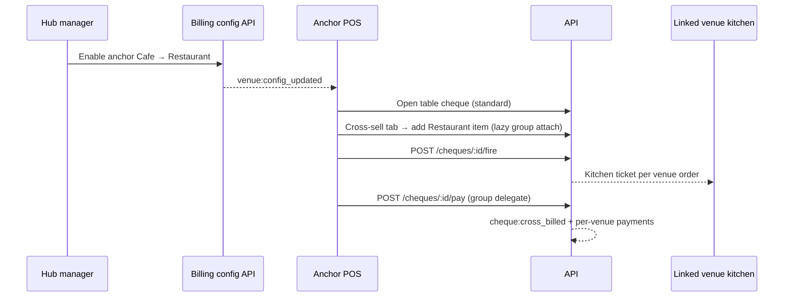

# Team Development Log

Chronological record of what we built, why, and how to verify. **Every developer adds an entry when merging feature work.**

Format for new entries → see [DEVELOPMENT.md](DEVELOPMENT.md#team-process).

---

## Phase 0 — Project foundation (June 2026)

### 2026-06-06 — Documentation & AI setup
**Phase:** 0 (pre-code)  
**Who:** Initial planning  
**What:** Created product and engineering docs for the team and Cursor agents.

**Files:**
- `docs/PRD.md` — user stories (US-1.1 through US-13.x), acceptance criteria
- `docs/Technical_Proposal.md` — architecture, hub-and-spoke, phased delivery
- `docs/TechSpec.md` — naming, WebSocket contracts, security, Docker, CI
- `AGENTS.md` — agent/developer entry point
- `apps/api/prisma/schema.prisma` — DB source of truth
- `.cursor/skills/` — venue-pos, implement-user-story, database-schema, offline-sync, websocket-events

**Verify:** Read `docs/README.md` index.

---

### 2026-06-06 — Monorepo scaffold (apps + packages)
**Phase:** 0.1  
**What:** npm workspaces monorepo with clear separation: deployable apps vs shared packages.

**Structure:**
```
apps/     → api, dashboard, pos, kds, local-agent
packages/ → shared, i18n
```

**Files:**
- Root `package.json` — workspace scripts (`dev:api`, `migrate`, etc.)
- `eslint.config.js`, `.prettierrc`, `.gitignore`
- `packages/shared` — `ROLES`, `ERROR_CODES`, `API_BASE`
- `packages/i18n` — `en.json`, `ar.json`, `getDirection()`

**Verify:**
```bash
npm install
npm run lint:i18n   # → "23 keys in sync"
```

---

### 2026-06-06 — API server foundation (Fastify + Prisma)
**Phase:** 0.2  
**Story:** Foundation for US-1.x auth  
**What:** Node API with Fastify, Prisma ORM, PostgreSQL, structured errors.

**Files:**
- `apps/api/prisma/schema.prisma` — `Venue`, `User`, `Terminal` models
- `apps/api/prisma/migrations/20260606120000_init/` — initial migration
- `apps/api/src/db/prisma.js` — PrismaClient singleton
- `apps/api/src/app.js`, `src/index.js` — Fastify bootstrap
- `apps/api/src/plugins/error-handler.js` — standard error JSON
- `apps/api/src/routes/health.js` — `GET /health`, `GET /health/ready`
- `apps/api/src/config.js` — env loading

**Removed:** Raw `pg` pool + manual SQL migrations (replaced by Prisma).

**Verify:**
```bash
docker compose up -d postgres
npm run migrate
curl http://localhost:3000/health
```

---

### 2026-06-06 — Auth skeleton (JWT RS256)
**Phase:** 0.3  
**Stories:** US-1.1 (manager login), US-1.2 (cashier PIN), US-1.3 (terminal headers)  
**What:** Manager login and cashier PIN auth with terminal validation.

**Endpoints:**
| Method | Path | Purpose |
|--------|------|---------|
| POST | `/api/v1/auth/login` | Manager username/password → JWT |
| POST | `/api/v1/auth/pin` | Cashier PIN + `X-Terminal-ID` + `X-Terminal-Secret` |
| POST | `/api/v1/auth/logout` | 204 no content |

**Files:**
- `apps/api/src/routes/auth.js`
- `apps/api/src/services/auth-service.js`
- `apps/api/src/middleware/auth.js` — `authenticate`, `requireRoles`
- `apps/api/src/utils/jwt.js` — RS256 sign/verify
- `scripts/generate-jwt-keys.mjs` → `ops/secrets/*.pem`
- `apps/api/src/auth.test.js` — health + login tests

**Verify:**
```bash
npm run generate:jwt-keys
npm run seed
npm run dev:api
curl -X POST http://localhost:3000/api/v1/auth/login \
  -H "Content-Type: application/json" \
  -d '{"username":"admin","password":"admin123"}'
```

---

### 2026-06-06 — Database seed (dev data)
**Phase:** 0.2  
**What:** Repeatable dev seed for venue, manager, cashier, terminal.

**Files:** `apps/api/src/db/seed.js`

**Seed data:**
| Entity | Value |
|--------|-------|
| Venue | Demo Cafe (anchor) |
| Manager | `admin` / `admin123` |
| Cashier | PIN `1234` (user `cashier1`) |
| Terminal ID | `00000000-0000-4000-8000-000000000001` |
| Terminal secret | `dev-terminal-secret` |

**Verify:** `npm run seed` then login via dashboard or curl.

---

### 2026-06-06 — Admin dashboard shell
**Phase:** 0.6  
**Stories:** US-11.1, US-11.2 (foundation)  
**What:** React + Vite + Tailwind admin with login, protected routes, EN/AR toggle, RTL.

**Files:**
- `apps/dashboard/src/pages/LoginPage.jsx`
- `apps/dashboard/src/pages/DashboardHome.jsx`
- `apps/dashboard/src/components/Layout.jsx`, `LanguageToggle.jsx`
- `apps/dashboard/src/hooks/useAuth.js`

**Verify:**
```bash
npm run dev:dashboard
# Open http://localhost:5173 — login admin/admin123 — toggle EN/ع
```

---

### 2026-06-06 — POS Electron shell
**Phase:** 0.7  
**What:** Electron + Vite POS with kiosk config, preload IPC bridge to local agent.

**Files:**
- `apps/pos/electron/main.cjs` — BrowserWindow, kiosk flag
- `apps/pos/electron/preload.cjs` — `window.venuePos.getAgentHealth()`
- `apps/pos/src/App.jsx` — agent status display

**Verify:**
```bash
npm run dev:agent
npm run dev:pos
# Or: npm run electron:dev -w @venue-pos/pos
```

---

### 2026-06-06 — KDS shell
**Phase:** 0.8  
**What:** Kitchen display Electron + Vite app with i18n.

**Files:** `apps/kds/src/App.jsx`, `electron/main.cjs`

**Verify:** `npm run dev:kds` → http://localhost:5175

---

### 2026-06-06 — Local agent shell
**Phase:** 0.8  
**Stories:** Foundation for US-7.x offline  
**What:** Fastify on :3456, SQLite WAL, sync_queue table stub, health endpoint.

**Files:**
- `apps/local-agent/src/db/sqlite.js`
- `apps/local-agent/src/server.js`
- `apps/local-agent/src/index.js`

**Verify:**
```bash
npm run dev:agent
curl http://127.0.0.1:3456/health
```

---

### 2026-06-06 — Docker & CI
**Phase:** 0.4, 0.5  
**What:** Local Postgres/Redis compose; API Dockerfile with Prisma migrate; GitHub Actions CI.

**Files:**
- `docker-compose.yml`, `docker-compose.dev.yml`
- `docker/Dockerfile.api`
- `ops/nginx/nginx.conf`
- `.github/workflows/ci.yml` — lint → api test (postgres service) → build frontends

**Verify:**
```bash
docker compose up -d postgres redis
npm run migrate && npm run test -w @venue-pos/api
npm run build:dashboard && npm run build:pos && npm run build:kds
```

---

### 2026-06-06 — Cursor rules & team docs (this entry)
**Phase:** 0  
**What:** Expanded Cursor rules for each tech layer; team documentation for onboarding.

**Files:**
- `.cursor/rules/` — core, team-workflow, monorepo, prisma, api-server, i18n-rtl, shared-packages, docker-ci, react-ui, electron-terminal
- `docs/README.md`, `docs/DEVELOPMENT.md`, `docs/TEAM_LOG.md`

**Verify:** New teammate follows `docs/DEVELOPMENT.md` from zero to running apps.

---

### 2026-06-06 — Documentation cleanup
**Phase:** 0  
**What:** Removed redundant spec files; consolidated docs and Cursor rules for a lean set.

**Removed:**
- `.cursor/PROJECT_SPEC.md` (duplicated TechSpec + Prisma schema)
- `.cursor/IMPLEMENTATION_PLAN.md` (duplicated TEAM_LOG + Technical_Proposal)
- `docs/REPO_STRUCTURE.md` (merged into DEVELOPMENT.md)
- `.cursor/skills/*/reference.md` (duplicated TechSpec §8 + outdated SQL)
- `.cursor/rules/README.md`, `fastify-api.mdc`, `database.mdc` (merged into api-server + prisma rules)

**Source of truth now:**
- DB → `apps/api/prisma/schema.prisma`
- WebSocket payloads → `docs/TechSpec.md` §8
- Roadmap → `docs/TEAM_LOG.md` + `docs/Technical_Proposal.md` §12
- Setup → `docs/DEVELOPMENT.md`

---

### 2026-06-06 — Phase 1 core slice: menu + POS order flow
**Phase:** 1  
**Stories:** US-2.1–2.3 (foundation), US-2.5 (publish), US-3.1–3.2 (foundation)  
**What:** Menu templates with categories/items, manager write + terminal read APIs, local-agent menu cache, POS menu grid with draft order creation.

**Schema:** `MenuTemplate`, `MenuTemplateVenue`, `Category`, `MenuItem`, `Order`, `OrderItem`  
**Migration:** `20260606130000_phase1_menu_orders`

**API endpoints:**
| Method | Path | Purpose |
|--------|------|---------|
| GET/POST | `/api/v1/menu-templates` | List / create templates |
| GET/PATCH | `/api/v1/menu-templates/:id` | Read / update template |
| POST | `/api/v1/menu-templates/:id/categories` | Add category |
| POST | `/api/v1/categories/:id/items` | Add menu item |
| POST | `/api/v1/menu-templates/:id/publish` | Publish menu + version hash |
| GET | `/api/v1/venues/:venueId/menu` | Terminal: published menu |
| POST | `/api/v1/orders` | Terminal: create draft order |
| POST | `/api/v1/orders/:id/items` | Terminal: add item to order |

**Local agent:** `GET /v1/menu`, `POST /v1/menu/sync`, `POST /v1/orders`, `POST /v1/orders/:id/items`  
**POS:** Category tabs, item grid, cart sidebar, new-order flow via IPC  
**Seed:** Demo Lunch Menu (published) for Demo Cafe

**Verify:**
```bash
nvm use 20.20.2
docker compose up -d postgres redis
npm run migrate && npm run seed
npm run test -w @venue-pos/api
npm run dev:api & npm run dev:agent & npm run dev:pos
# POS: New order → tap items → see cart total
```

**Dev IDs (after seed):**
| Entity | ID |
|--------|-----|
| Venue | `00000000-0000-4000-8000-000000000010` |
| Cashier | use `cashier1` row id from DB (see seed output) |

---

### 2026-06-06 — Phase 1 complete: modifiers, kitchen send, dashboard menu manager
**Phase:** 1  
**Stories:** US-2.4, US-2.5, US-3.2–3.3 (foundation), US-1.2 (PIN on POS)  
**What:** Modifier groups with order-time snapshots, Socket.IO `menu:updated` + `order:created`, full order lifecycle (qty, remove, send, receipt), dashboard menu manager, POS PIN login + modifier modal, local-agent sync replay + WS menu listener.

**Migration:** `20260606140000_phase1_modifiers_kitchen` (ModifierGroup, ModifierOption, MenuItemModifier, Order.sentAt, OrderItem.modifiersSnapshot)

**Additional API endpoints:**
| Method | Path | Purpose |
|--------|------|---------|
| GET | `/api/v1/venues` | List venues (dashboard) |
| PUT | `/api/v1/menu-templates/:id/categories/reorder` | Reorder categories |
| POST | `/api/v1/menu-templates/:id/modifier-groups` | Create modifier group |
| PATCH | `/api/v1/menu-items/:itemId` | Update item / 86 toggle |
| PATCH | `/api/v1/orders/:id/items/:itemId` | Update item quantity |
| DELETE | `/api/v1/orders/:id/items/:itemId` | Remove draft item |
| POST | `/api/v1/orders/:id/send` | Send order to kitchen |
| GET | `/api/v1/orders/:id/receipt` | Basic receipt text |

**Local agent:** `POST /v1/sync/replay`, `PATCH/DELETE /v1/orders/:id/items/:itemId`, `POST /v1/orders/:id/send`, `GET /v1/orders/:id/receipt`  
**Dashboard:** `MenuManagerPage` — templates, categories, items, publish, 86 toggle  
**POS:** PIN login, modifier modal, cart qty +/-, send kitchen, receipt display  
**Tests:** `phase1.test.js` (12 API tests total) + `scripts/phase1-scenarios.mjs` (integration smoke)

**Verify:**
```bash
nvm use 20.20.2
docker compose up -d postgres redis
npm run migrate && npm run seed
npm run lint && npm run lint:i18n && npm run test -w @venue-pos/api
npm run dev:api & npm run dev:agent & npm run dev:dashboard & npm run dev:pos
node scripts/phase1-scenarios.mjs   # with API + agent running
```

**Dev credentials (after seed):**
| Entity | Value |
|--------|-------|
| Manager | `admin` / `admin123` |
| Cashier PIN | `1234` |
| Cashier ID | `00000000-0000-4000-8000-000000000011` |
| Venue ID | `00000000-0000-4000-8000-000000000010` |
| Terminal ID | `00000000-0000-4000-8000-000000000001` |
| Terminal secret | `dev-terminal-secret` |

**Deferred to Phase 2+:** KDS `order:created` UI, kitchen printer, category drag-and-drop UI, full offline conflict resolution (Phase 6).

---

### 2026-06-06 — Docs: KDS optional at onboarding + cleanup
**Phase:** 1 (docs)  
**What:** Documented `kds_enabled` / `FEATURE_KDS_ENABLED` — KDS is a provider onboarding toggle, not required for every hub (printer-only OK). Cleaned stale roadmap/audit/Electron references across `DEVELOPMENT.md`, `README.md`, `AGENTS.md`, `PRD.md`, `TEAM_LOG.md`.

**Verify:** Read `docs/DEVELOPMENT.md` § Optional features (provider onboarding).

---

### 2026-06-06 — CI fix: Prisma generate without DB + Electron Node 20
**Phase:** 1 (tooling)  
**What:** CI `npm ci` failed — `prisma.config.ts` required `DATABASE_URL` at install time; `electron@42` requires Node ≥22 while CI/dev use Node 20.

**Fix:** Removed `datasource` from `prisma.config.ts`; dummy `DATABASE_URL` in `prisma-generate.mjs` for generate-only; Electron `^40.10.2` (Node 20 + audit clean).

**Verify:** `DATABASE_URL= npm ci` on lint job path; `npm audit` → 0 vulnerabilities.

---

### 2026-06-06 — Install/audit/Prisma team docs
**Phase:** 1 (tooling)  
**What:** Clarified npm audit highs (Electron + tar, not Prisma), migrated to `prisma.config.ts`, pinned `tar` override, upgraded Electron, made `prisma-generate` retry-only on failure.

**Files:** `apps/api/prisma.config.ts`, `scripts/prisma-generate.mjs`, root `package.json` overrides, `apps/pos/package.json`, `docs/DEVELOPMENT.md`

**Also:** `bcrypt@6` (drops vulnerable `tar` chain), Electron `^40.10.2` in POS + KDS (Node 20).

**Verify:** `npm install` → `found 0 vulnerabilities`; no `package.json#prisma` warn; `npm run db:generate` quiet unless EPERM retry on Z:.

---

### 2026-06-06 — PR #1 review fixes (Phase 1 hardening)
**Phase:** 1 (bugfix)  
**What:** Addressed valid Copilot review comments from PR #1 — Socket.IO decoration, sync queue enqueue-on-failure only, qty replay, smoke script guards, POS `lang` on load.

**Files:**
- `apps/api/src/app.js` — `app.decorate('io', null)` so encapsulated routes see `request.server.io`
- `apps/local-agent/src/services/orders.js` — removed eager `enqueueSync` from local writes
- `apps/local-agent/src/server.js` — enqueue only when immediate API sync fails; `order.patch_item` on qty failure
- `apps/local-agent/src/services/sync-processor.js` — replay handler for `order.patch_item`
- `apps/pos/src/i18n.js` — set `<html lang>` on initial load
- `scripts/phase1-scenarios.mjs` — skip order scenarios when menu/order prerequisites missing

**Verify:**
```bash
npm run lint && npm run test -w @venue-pos/api && npm run test -w @venue-pos/local-agent
npm run dev:api & npm run dev:agent
node scripts/phase1-scenarios.mjs
```

---

### 2026-06-06 — Fix local-agent sync queue false success
**Phase:** 1 (bugfix)  
**What:** `fetch()` does not throw on HTTP 4xx/5xx. Sync replay was marking queue jobs `done` even when the API rejected them, so failed orders could disappear from the retry queue.

**Files:**
- `apps/local-agent/src/services/api-fetch.js` — shared helper with `res.ok` check
- `apps/local-agent/src/services/sync-processor.js` — uses `apiFetch`; only marks `done` on success
- `apps/local-agent/src/services/orders.js` — imports shared `apiFetch`
- `apps/local-agent/src/server.js` — add-item inline fetch uses `apiFetch`
- `apps/local-agent/src/services/sync-processor.test.js` — failure keeps `pending` + increments `retry_count`

**Verify:**
```bash
npm run test -w @venue-pos/local-agent
npm run dev:agent   # stop API, create order on POS, confirm sync_queue stays pending
```

---

## Phase 2 — In progress (`phase-2` branch)

Kitchen output — **KDS is optional per client** (`kds_enabled` at provider onboarding). Printer-only sites skip `apps/kds`; still deliver send-to-kitchen, printer, and status APIs.

### 2026-06-06 — US-6.1 KDS order display (started)

**What:** `GET /api/v1/kitchen/orders`, KDS socket joins `venue:{id}:kitchen` via `clientType: 'kds'`, live `order:created` tickets in `apps/kds` with age color coding. Gated by `FEATURE_KDS_ENABLED` / `VITE_FEATURE_KDS_ENABLED`.

**Files:** `apps/api/src/routes/kitchen.js`, `apps/api/src/services/order-service.js`, `apps/api/src/plugins/socket.js`, `apps/kds/src/App.jsx`, `packages/i18n/locales/*.json`

**Verify:**
```bash
npm run dev -- --kds
# POS: checkout an order → ticket appears on http://localhost:5175
npm run test -w @venue-pos/api
```

### 2026-06-06 — US-6.2 / US-3.4 kitchen item status (started)

**What:** `OrderItem.kitchenStatus` enum, `PATCH /api/v1/kitchen/orders/:id/items/:itemId/status`, auto order status (`sent` → `partially_ready` → `ready` → `served`), `order:item_status` WebSocket to POS + KDS. KDS Start/Ready/Bump buttons; POS kitchen progress bar after checkout.

**Migration:** `20260606150000_phase2_item_kitchen_status`

**Verify:**
```bash
npm run migrate -w @venue-pos/api
npm run dev -- --kds
# POS checkout → KDS Start/Ready/Bump → POS footer updates live
```

### 2026-06-06 — POS Clear (start over) — US-3.5 void removed from cashier UI

**What:** Draft cart **Clear** abandons the order (`POST /api/v1/orders/:id/abandon`) — no manager PIN. Removes orphan drafts locally + on server. Matches real F&B: fix mistakes with **−** or start over with **Clear** while building the tab.

**Removed from POS:** Void button/modal (did not match open-cheque workflow). Backend `void` API + audit schema kept for Phase 3 cheque management.

**Verify:**
```bash
npm run test -w @venue-pos/api
# POS: add items → Clear → empty cart, fresh order
```

### 2026-06-06 — US-6.3 kitchen printer

**What:** Local agent prints ESC/POS text ticket on send when `KITCHEN_PRINTER_HOST` is set (TCP port 9100, 3 retries). `/health` exposes `printer` status; POS footer shows printer connected/offline from agent health.

**Env:** `apps/local-agent/.env` — `KITCHEN_PRINTER_HOST`, `KITCHEN_PRINTER_PORT` (see `.env.example`)

**Verify:**
```bash
# Without printer host: health shows not_configured, POS shows connected
# With host: send order → ticket prints; failed host → printer offline in POS
```

**Remaining Phase 2 (nice-to-have):**
- SLA alerts, station grouping, KDS undo
- Venue-level printer config in dashboard

### Deferred — Phase 3 open cheque / tab management (real F&B model)

Reference: Toast, Square, Lightspeed, Oracle Simphony — **open check** per table/guest.

| Today (Phase 1–2) | Target (Phase 3+) |
|-------------------|-------------------|
| Checkout sends to kitchen then **starts a new order** | **Fire** new items to kitchen; **same cheque stays open** |
| One-shot order session | Guest stays hours; add rounds whenever |
| No cheque entity in POS | `cheques` table: open → paid / voided |
| Void on draft cart | **Clear** only on draft; manager void/comp on **running or paid cheques** |

**Phase 3 scope:** See **Phase 3 — In progress** below. Slice 1–4 shipped on `phase-3`; bill split (US-3.6), transfers, shifts, refunds still deferred.

---

## Phase 3 — Closed (`phase-3` branch → PR to `main`)

Open cheques / tabs + payments (see deferred scope above). Branch created from `phase-2`; merge PR #2 to `main` when ready, then rebase `phase-3` on `main` if needed.

**First slice (planned):**
1. `cheques` + `cheque_orders` schema + migration
2. API: open cheque, list open by venue/table, attach orders
3. POS: open/resume table cheque; **Fire** keeps same cheque open
4. Pay cheque (cash) → close
5. Dashboard: open cheques + manager void/comp (web)

### 2026-06-07 — Open cheque model (API + POS slice 1)

**What:** Real tab/cheque lifecycle — one open cheque per table, multiple kitchen rounds, cash pay to close.

**Schema:** `Cheque`, `ChequeOrder`, `Payment` + enums `ChequeStatus`, `PaymentMethod`. Migration `20260607120000_phase3_cheques`.

**API** (`apps/api/src/services/cheque-service.js`, `routes/cheques.js`):
- `POST /api/v1/cheques/open` — open or resume by `tableLabel`
- `GET /api/v1/cheques/open` — list open cheques for venue
- `GET /api/v1/cheques/:id` — detail + running total
- `POST /api/v1/cheques/:id/fire` — send draft round, spawn new draft on same cheque
- `POST /api/v1/cheques/:id/clear` — abandon current draft round
- `POST /api/v1/cheques/:id/pay` — cash (or card/voucher) closes cheque; sent orders → `closed`

**POS:** Opens cheque on load / table change; **Fire to kitchen** calls cheque fire (stays on same cheque); **Pay cash** when fired total > 0 and draft empty. Receipt panel shows cheque # + cheque total.

**Agent:** Proxies `/v1/cheques/*` to API; prints kitchen ticket on fire.

**Verify:**
```bash
npm run migrate
npm run test
# POS: add items → Fire twice → Pay cash → new cheque for same table
```

**Still deferred:** Bill split (US-3.6), line transfer, integrated card terminal, vouchers, refunds, cross-venue.

### 2026-06-07 — Payments slice (split pay + receipt)

**What:** US-5.1/US-5.4 partial — cash with change, split cash+card, cheque receipt text + auto-print on pay.

**API:**
- `payCheque` accepts `payments[]` (1–5 lines); sum must equal cheque total
- `tendered` for cash change on receipt
- Returns `{ cheque, receipt, change }`
- `GET /api/v1/cheques/:id/receipt`

**POS:** Pay modal — Cash (tender + change) or Split (cash + card amounts).

**Agent:** Prints customer receipt on pay when printer configured.

### 2026-06-07 — Dashboard open cheques + manager void (slice 2)

**What:** Managers view open tabs and void kitchen rounds or entire cheques from the web dashboard (manager PIN + audit).

**API** (`routes/manager-cheques.js`, `cheque-service.js`):
- `GET /api/v1/manager/cheques/open` — JWT; hub manager optional `?venueId=`
- `GET /api/v1/manager/cheques/:id`
- `POST /api/v1/manager/cheques/:id/orders/:orderId/void` — void one round (`sent`…`served`)
- `POST /api/v1/manager/cheques/:id/void` — void entire open cheque → `ChequeStatus.voided`
- Emits `order:voided` to KDS/POS when applicable

**Dashboard:** `/cheques` — open list, running total, per-round void, void entire cheque modal (PIN + reason).

**Verify:**
```bash
npm run test
# Dashboard: admin / admin123 → Open cheques → void round (manager PIN 9999)
```

### 2026-06-06 — KDS feature-flag hardening (PR #2 review)

**What:** KDS shows `kds.disabled` on API 403 (env mismatch). Socket rejects `clientType: 'kds'` when `FEATURE_KDS_ENABLED=false`; kitchen WS emits (`order:created`, `order:item_status`, `order:voided`) skipped when KDS off.

### 2026-06-06 — POS label: Checkout → Fire to kitchen

**What:** POS primary action uses `pos.sendKitchen` (“Fire to kitchen” / “إرسال للمطبخ”) instead of “Checkout” — avoids implying payment; real checkout comes with Phase 3 cheques.

### 2026-06-08 — Comp, paid history, POS open-tab browser (slice 4)

**Stories:** US-3.5 (manager comp on running cheque), US-5.1 (pay closes orders)

**What:** Manager comps individual fired line items (excluded from total/receipt); pay sets kitchen orders to `closed`; dashboard Open/Paid tabs; POS horizontal open-cheque picker.

**Schema:** `OrderItem.isComped`, `OrderItemCompAudit`. Migration `20260608120000_phase3_item_comp`.

**API:**
- `GET /api/v1/manager/cheques?status=open|paid|voided` — paid history (newest first)
- `POST /api/v1/manager/cheques/:id/orders/:orderId/items/:itemId/comp` — manager PIN + reason + audit
- `payCheque` — billable orders → `closed` (not `billed`)
- Paid cheque `total` from payment sum; comped lines show `[COMP]` on receipt

**Dashboard:** `/cheques` — Open / Paid tabs, per-line **Comp**, payments on paid detail.

**POS:** Chip row of open tables (`GET /v1/cheques/open`) — tap to resume another tab.

**Verify:**
```bash
npm run migrate
npm run test
npm run lint:i18n
# Dashboard: Open tab → Comp line (PIN 9999) → total drops
# Dashboard: Paid tab after POS pay
# POS: two tables open → switch via chips
```

**Still deferred:** Bill split (US-3.6), line transfer, shifts (US-13.1), refunds (US-5.6), cross-venue (Epic 4), receipt PDF.

### 2026-06-09 — Bill split by item (US-3.6 slice 5)

**What:** Split open cheque into sub-cheques by assigning fired line items; each sub-cheque paid independently; parent auto-closes when all splits (and remainder) are paid.

**Schema:** `Cheque.parentChequeId`, `Cheque.splitLabel`, `OrderItem.billingChequeId`, `OrderItem.paidAt`. Migration `20260609120000_phase3_cheque_split`.

**API:**
- `POST /api/v1/cheques/:id/split` — `{ splits: [{ label, itemIds }] }` (1–8 splits)
- Pay on child marks items `paidAt`; parent finalizes when all children + remainder settled
- `serializeCheque` includes `childCheques`, `parentCheque`, filtered item totals

**POS:** Split bill modal (Guest 1 / Guest 2 item checkboxes); sub-cheques in open-tab chips.

**Dashboard:** Sub-cheques list on parent detail; split label in open/paid lists.

**Verify:**
```bash
npm run migrate
npm run test
# POS: fire 2 rounds → Split bill → pay each guest chip
```

**Still deferred:** Split by seat, split by custom amount, line transfer, shifts, refunds, cross-venue, receipt PDF.

### 2026-06-09 — Structure refactor (agent routes, POS components, cheque services)

**What:** No behavior change — reorganized bloated files to match `.cursor/rules` and dashboard patterns.

**local-agent:** `server.js` → thin bootstrap; routes in `src/routes/{health,menu,sync,orders,cheques}.js`.

**POS:** `App.jsx` ~200 lines wiring; `api/agent.js`, `hooks/*`, `components/*`, `utils/*`.

**API:** `cheque-service.js` barrel; logic split into `cheque-shared.js`, `cheque-lifecycle.js`, `cheque-pay.js`, `cheque-split.js`, `cheque-manager.js`.

**Verify:** `npm run test` + `npm run lint:i18n` — all green.

### 2026-06-10 — Shift open/close (US-13.1 / US-13.2 slice 6)

**What:** Cashier declares opening float, payments link to active shift, close shift reconciles cash with over/short + manager PIN when above threshold.

**Schema:** `Shift`, `ShiftEvent`, `Payment.shiftId`. Migration `20260610120000_phase3_shifts`.

**API** (`shift-service.js`, `routes/shifts.js`):
- `GET /api/v1/shifts/active?cashierId=`
- `POST /api/v1/shifts/open` — one open shift per cashier
- `POST /api/v1/shifts/close` — expected cash = open float + cash payments; manager PIN if |over/short| > 50 EGP
- `payCheque` requires active shift on terminal; links `shiftId` on payments

**POS:** Blocking open-shift modal on load; header shift badge → close modal with reconciliation.

**Agent:** Proxies `/v1/shifts/*`.

**Verify:**
```bash
npm run migrate
npm run test -w @venue-pos/api
npm run lint:i18n
# POS: open shift (float) → pay cheque → close shift (counted cash)
```

**Still deferred:** Split by seat, split by custom amount, line transfer, refunds, cross-venue, receipt PDF.

### 2026-06-11 — Manual card payment + provider flag (US-5.3 slice 7)

**What:** External-terminal card recording with optional last-4, manager PIN above threshold, provider deploy toggle.

**Provider flag:** `FEATURE_MANUAL_CARD_PAYMENT=true|false` (default **OFF**). POS reads `GET /api/v1/features` via agent — card tab hidden when OFF.

**Schema:** `Payment.cardLast4`. Migration `20260611120000_phase3_manual_card`.

**API** (`payment-policy.js`, `routes/features.js`):
- `GET /api/v1/features` — `manualCardPayment`, `manualCardApprovalThreshold`, `kdsEnabled`
- `payCheque` — rejects card when flag OFF; manager PIN when card total ≥ `MANUAL_CARD_APPROVAL_THRESHOLD` (default 500 EGP)
- Receipt shows `card ****1234` when last-4 stored

**POS:** Pay modal — Cash | Card (manual) | Split when enabled; manual-entry banner + optional last-4.

**Verify:**
```bash
# In apps/api/.env for local dev:
FEATURE_MANUAL_CARD_PAYMENT=true
npm run migrate
npm run test -w @venue-pos/api
npm run lint:i18n
```

**Still deferred:** Split by seat, refunds, cross-venue, receipt PDF, integrated terminal (US-5.2). See `docs/PHASE3_SCALABLE_PLAN.md`.

### 2026-06-12 — Line transfer + split by amount (slice 8)

**What:** Move fired lines between tables (provider flag); split cheque by arbitrary dollar amounts.

**Provider flag:** `FEATURE_LINE_TRANSFER=true|false` (default OFF). POS `lineTransfer` from `/api/v1/features`.

**Schema:** `Cheque.splitAmount`, `ChequeItemTransferAudit`. Migration `20260612120000_phase3_transfer_amount`.

**API:**
- `POST /api/v1/cheques/:id/transfer` — manager PIN, audit log
- `POST /api/v1/cheques/:id/split-amount` — `{ splits: [{ label, amount }] }`
- `GET /api/v1/manager/cheques/transfers` — GM/manager audit list

**POS:** Transfer modal (flagged); split-by-amount modal; pay amount-split child chips.

**Scalable plan:** `docs/PHASE3_SCALABLE_PLAN.md` — seat split, integrated PDQ, post-payment GM refunds (deferred).

**Verify:**
```bash
FEATURE_LINE_TRANSFER=true
npm run migrate
npm run test -w @venue-pos/api
```

---

## Slice 9 — Discounts, receipt print, refunds (US-5.6)

**What:** Cheque-level discounts (amount or %), auto customer receipt on checkout via agent, post-payment refunds with audit.

**Schema:** `Cheque.discountAmount`, `ChequeDiscountAudit`, `Refund` (+ shift cash impact).

**API:** `GET /api/v1/features` — `discounts`, `refunds`, `autoReceiptPrint`. Direct apply endpoints in slice 10.

**Flags (default ON):** `FEATURE_DISCOUNTS_ENABLED`, `FEATURE_REFUNDS_ENABLED`, `FEATURE_AUTO_RECEIPT_PRINT`

**POS:** Receipt shows discount line; agent prints on pay when printer configured.

**Seed:** `venue_mgr` PIN `7777` (restaurant manager); `admin` / `9999` (hub manager).

**Verify:**
```bash
npm run migrate
npm run test -w @venue-pos/api
```

---

## Slice 9b — GM approval queue (superseded by slice 10)

**Historical:** Restaurant manager requested → GM approved on `/approvals`. Replaced by venue-manager direct apply + Activity log.

---

## Slice 10 — Venue manager authority + Phase 3 close

**What:** Venue manager executes all sensitive cheque actions; GM reviews audit feed (no approval queue).

**API:**
- `POST /api/v1/cheques/:id/discount` · `POST .../refund` (terminal + venue manager PIN)
- `POST /api/v1/manager/cheques/:id/discount` · `.../refund` (venue_manager JWT)
- `GET /api/v1/manager/activity` — unified audit (hub_manager)
- `GET /api/v1/cheques/paid` — POS paid-cheque picker
- Void/comp/transfer — `venue_manager` PIN only; paid void/comp triggers partial refund

**Socket:** `manager:action` on POS (replaces approval poll).

**Dashboard:** `/activity` replaces `/approvals`; ChequesPage refactored into components + `useChequeManager`.

**POS:** Direct discount apply; refund paid cheque flow; `useManagerSocket`.

**Verify:**
```bash
npm run test -w @venue-pos/api
npm run lint && npm run lint:i18n
```

---

## Phase 3 — closed

**Shipped (slices 1–10):** Open cheques, fire/pay, split item + amount, line transfer, shifts, manual card, comp/void, discounts, refunds, receipt print, venue-manager authority, Activity log, POS refund UI, paid void/comp, socket updates, dashboard cheques refactor.

**Deferred (post–Phase 3):** Seat split, vouchers, integrated PDQ, receipt PDF, cross-venue (Epic 4), offline sync (Phase 6). See `docs/PHASE3_SCALABLE_PLAN.md`.

**Next phase:** Phase 5 — dashboard revenue analytics (GM / hub owner view).

---

## Phase 5 — Epic 8 admin dashboard (`Phase-5` branch)

### 2026-06-07 — US-8.1 Live sales overview (slice 1)

**Story:** US-8.1  
**What:** Hub/venue manager live metrics — revenue today, active kitchen orders, orders/min, open-table heat map. REST snapshot + `dashboard:metrics_tick` every 60s.

**API** (`metrics-service.js`, `routes/manager-metrics.js`, `plugins/metrics-ticker.js`):
- `GET /api/v1/manager/metrics/live` — hub_manager (all venues) or venue_manager (own venue)
- WebSocket `dashboard:metrics_tick` → `dashboard:hub_manager` + per-venue rooms

**Dashboard:** `DashboardHome` — KPI cards, per-venue open-table heat map, live socket updates via `useMetricsSocket`.

**Verify:**
```bash
npm run migrate && npm run test -w @venue-pos/api
npm run lint:i18n
npm run dev:api & npm run dev:dashboard
# Login admin/admin123 → home shows live KPIs; pay a cheque on POS → revenue updates within 60s
```

**Deferred (Phase 5 slice 2+):** US-8.2 revenue analytics charts, US-8.3 order explorer.

---

### 2026-06-07 — US-8.2 Revenue analytics (slice 2)

**Story:** US-8.2  
**What:** Revenue analytics with period presets, venue/category/item drill-down, period comparison, Recharts bar chart, CSV export.

**API** (`analytics-service.js`, `routes/manager-analytics.js`):
- `GET /api/v1/manager/analytics/revenue?preset=&venueId=&categoryId=&format=csv`
- Presets: today, yesterday, week, last_week, month, last_month, custom
- Net revenue from payments minus refunds; category/item breakdown from paid cheques

**Dashboard:** `/analytics` — preset buttons (incl. **custom range** with start/end date pickers), venue filter (hub), KPI + comparison, bar chart, category/item tables, CSV export.

**Verify:**
```bash
npm run test -w @venue-pos/api
npm run lint && npm run lint:i18n
npm run dev:dashboard
# Login admin/admin123 → Analytics → switch presets; pick venue → drill category → Export CSV
```

**Deferred (Phase 5 slice 3):** US-8.3 order explorer.

---

### 2026-06-07 — US-8.3 Order explorer (slice 3)

**Story:** US-8.3  
**What:** Searchable order explorer with filters, pagination (50/page), drill-down detail, void reason, split-cheque linkage, receipt reprint, CSV export.

**API** (`order-explorer-service.js`, `routes/manager-orders.js`):
- `GET /api/v1/manager/orders` — search/filter + `format=csv`
- `GET /api/v1/manager/orders/:id` — line items, modifiers, payments, void audit, cheque splits
- `GET /api/v1/manager/orders/:id/receipt` — reprint order receipt
- `GET /api/v1/manager/cheques/:id/receipt` — reprint cheque receipt (manager auth)

**Dashboard:** `/orders` — **venue_manager only** (hidden from hub admin nav). Cheques grouped by shift → cheques → orders; cheque # search; detail shows all rounds on a tab.

**Verify:**
```bash
npm run test -w @venue-pos/api
npm run lint && npm run lint:i18n
npm run dev:dashboard
# Login as venue_manager → Orders tab visible; cheques nested under shifts
# Login admin/admin123 → no Orders tab (hub uses Analytics, Cheques, Activity)
```

**Note:** Cross-venue cheque linkage deferred with Phase 4; split parent/child cheques shown instead.

---

### 2026-06-07 — US-8.4 Menu Manager polish (slice 4)

**Story:** US-8.4  
**What:** Full menu manager UX — template edit, drag-drop category reorder, bilingual item editor, missing-translation badges, publish confirmation, POS preview, CSV import/export, suggest-Arabic review flow.

**API** (`menu-translations.js`, `routes/menus.js`):
- `GET /api/v1/menu-templates/:id/translations/export` — CSV download
- `POST .../translations/import` — bulk update from CSV
- `GET .../translations/suggest` — missing Arabic names with EN copy as draft
- `POST .../translations/apply` — batch apply reviewed translations
- Optional `nameAr` on create (draft menus may omit Arabic until review)

**Dashboard:** `/menus` refactored — `useMenuManager`, bilingual fields, category drag reorder, item modal, publish confirm, POS preview modal, translation tools.

**Verify:**
```bash
npm run test -w @venue-pos/api
npm run lint:i18n
npm run dev:dashboard
# Login admin/admin123 → Menus → edit template, drag categories, add item (EN+AR), Preview, Suggest Arabic, Export/Import CSV, Publish (confirm)
```

**Deferred:** External auto-translate API (suggest copies EN for manager review); item drag reorder within category.

---

### 2026-06-07 — POS table switch UX (read-only header + modal)
**Phase:** 5 · **Story:** POS polish (table navigation)
**What:** Replaced editable table input with read-only header badge + Tables modal; smart rename for empty cheques; confirm when leaving table with items; receipt chip row for parent tables only.
**Files:** `apps/api/src/services/cheque-lifecycle.js`, `routes/cheques.js`, `apps/local-agent/src/routes/cheques.js`, `apps/pos/src/hooks/useChequeSession.js`, `App.jsx`, `PosHeader.jsx`, `TableSwitchModal.jsx`, `ReceiptPanel.jsx`, `preload.cjs`, `packages/i18n/locales/{en,ar}.json`
**Verify:**
```bash
npm run test -w @venue-pos/api
npm run dev:pos
# Header shows table badge + open count → Tables opens grid modal
# Empty table rename via new table name; confirm strip when switching with draft/fired items
```
**Notes:** `DELETE /api/v1/cheques/:id` removes empty open tables (no fired items, no draft lines). Table rename removed — opening a new label always creates/resumes that table.

---

### 2026-06-07 — Dashboard nav, Activity log UX, shared auth

**What:** Header tab navigation (blue bar); Activity page filter chips, day groups, structured cards; `AuthProvider` fixes logout (shared session state).

**Files:** `apps/dashboard/src/components/DashboardNav.jsx`, `Layout.jsx`, `pages/ActivityPage.jsx`, `hooks/useAuth.js`, `main.jsx`, `packages/i18n/locales/{en,ar}.json`

**Verify:** Login admin → tabs in header; Activity filters work; Logout returns to login.

---

### 2026-06-07 — Order explorer: cheque + shift grouping (US-8.3 polish)

**What:** Venue-manager order explorer groups **cheques by shift**, each cheque lists all order rounds. Cheque # filter/search; detail panel shows every order on the tab.

**API** (`order-explorer-service.js`):
- `GET /api/v1/manager/orders?groupBy=shift` (default for dashboard)
- `GET /api/v1/manager/orders?groupBy=cheque`
- `GET /api/v1/manager/orders/by-cheque/:id` — all rounds + line items
- Shift assignment: payment `shiftId`, else cashier/terminal time match

**Dashboard:** Orders nav **venue_manager only** — not shown to hub_manager (admin).

**Verify:**
```bash
npm run test -w @venue-pos/api
npm run dev:dashboard
# venue_manager login → Orders → shifts contain cheques; click cheque for detail
# admin login → no Orders tab
```

---

### 2026-06-07 — Refund approval workflow (venue request → hub approve)
**Phase:** 5 · **Story:** US-5.6 / manager authority
**What:** Venue managers request refunds (POS + dashboard); hub manager approves/rejects on Approvals page or force-refunds from Cheques. Uses `ManagerApprovalRequest` queue.
**Files:** `approval-request-service.js`, `manager-approvals.js`, dashboard `ApprovalsPage`, POS/dashboard cheque UI, i18n
**Verify:**
```bash
npm run test -w @venue-pos/api
npm run dev:dashboard
# venue_mgr → Cheques → paid tab → Request refund
# admin → Approvals → Approve, or Cheques → Force refund
# POS → Refund paid cheque → venue PIN → hub approves
```

---

### 2026-06-07 — US-8.9 Shift management dashboard (slice 1)
**Phase:** 5 · **Story:** US-8.9
**What:** Manager shift list/detail API, CSV export, force-close, dashboard Shifts page with filters and cash report panel.
**Files:** `apps/api/src/services/manager-shift-service.js`, `apps/api/src/routes/manager-shifts.js`, `apps/api/src/services/shift-service.js` (`forceCloseShiftById`), `apps/dashboard/src/pages/ShiftsPage.jsx`, nav/routes, i18n
**Verify:**
```bash
npm run test -w @venue-pos/api
npm run lint:i18n
npm run dev:dashboard
# hub or venue_manager → Shifts → filter, detail, CSV, force-close open shift (manager PIN)
```
**Notes:** EOD reconciliation view deferred to slice 2.

---

## Phase 5 — Remaining (Epic 8)

| Story | Status | Notes |
|-------|--------|-------|
| US-8.1 Live sales overview | ✅ | Metrics + WebSocket tick |
| US-8.2 Revenue analytics | ✅ | Charts, drill-down, CSV |
| US-8.3 Order explorer | ✅ | Venue manager only; shift → cheque → orders |
| US-8.4 Menu manager | ✅ (core) | Auto-translate API deferred |
| US-8.5 Venue configuration | ✅ | Tax, printers, WS sync, audit |
| US-8.6 Billing rules | ✅ | Shipped Phase 4 — `BillingMatrixSection` on Settings |
| US-8.7 User management | ✅ | Venue manager staff CRUD, PIN/RFID, CSV |
| US-8.8 Inventory | ❌ | Out of scope — not planned |
| US-8.9 Shift management (dashboard) | ✅ | List, detail, EOD reconciliation, force-close, CSV |
| US-8.10 System health | ✅ | Terminals, sync queue, server memory, WS |
| US-8.11 Audit log (full) | ✅ | Unified feed, filters, CSV export |

**Phase 4 (US-8.6) shipped 2026-06-08** — see § Roadmap below for next steps.

---

### 2026-06-07 — US-8.5 Venue configuration (slice 1)
**Phase:** 5 · **Story:** US-8.5
**What:** Hub manager venue settings page — names, type, tax, receipt template, printer hosts; config audit log; terminal settings API; `venue:config_updated` WebSocket; local-agent printer sync.
**Files:** `schema.prisma`, migration `20260615120000_venue_config`, `venue-config-service.js`, `manager-venue-config.js`, `VenueSettingsPage.jsx`, `venue-config-sync.js`, socket emit, i18n
**Verify:**
```bash
npm run migrate
npm run test -w @venue-pos/api
npm run dev:dashboard
# admin → Venue settings → edit venue → Save → check config/audits APIs
```

---

### 2026-06-07 — Venue service charge (US-8.5)
**Phase:** 5 · **Story:** US-8.5
**What:** Optional service charge on venue config (rate + enable toggle); applied to cheque totals with tax on POS receipt panel.
**Files:** migration `20260615140000_venue_service_charge`, `venue-charges.js`, `cheque-shared.js`, `VenueSettingsPage.jsx`, i18n, `ReceiptPanel.jsx`
**Verify:** `npm run migrate` · `npm run test -w @venue-pos/api` · enable 12% service on venue → POS cheque shows service line

---

### 2026-06-07 — Remove venue table layout editor (deferred)
**Phase:** 5 · **Story:** US-8.5 trim
**What:** Removed dashboard floor-plan editor and `venues.table_layout` — no POS consumer was planned; avoids half-shipped admin UI.
**Files:** migration `20260615130000_drop_venue_table_layout`, `venue-config-service.js`, `VenueSettingsPage.jsx`, i18n, PRD
**Verify:** `npm run migrate` · `npm run test -w @venue-pos/api` · Venue settings loads without table layout section

---

### 2026-06-07 — US-8.7 / 8.9 slice 2 / 8.10 / 8.11 (admin ops slice)

**Stories:** US-8.7, US-8.9 slice 2, US-8.10, US-8.11  
**What:** Venue-manager staff CRUD (cashier/kitchen), EOD reconciliation on Shifts page, system health panel, full audit log with filters + CSV. Inventory (US-8.8) **out of scope** — not planned.

**API:**
- `GET/POST/PATCH /api/v1/manager/users` — venue_manager only (staff CRUD, PIN reset, deactivate, CSV import/export)
- `GET /api/v1/manager/shifts/eod` — daily rollup (hub all venues, venue_manager own venue)
- `GET /api/v1/manager/health` — terminals, sync queue, server memory, WS counts
- `GET /api/v1/manager/audit` — hub_manager unified audit (manager actions + config + shifts + auth/menu/user logs)
- `POST /api/v1/terminals/heartbeat` — updates `last_seen_at` + `sync_queue_depth`
- Migration `20260616120000_phase5_users_audit_health` — `audit_logs` table

**Dashboard:** `/users` (venue_manager), `/health`, enhanced `/activity` audit, EOD panel on `/shifts`, nav/layout guards fixed (hub → activity/settings/shifts; venue → users).

**Verify:**
```bash
npm run migrate
npm run test -w @venue-pos/api
npm run lint && npm run lint:i18n
# venue_mgr → Staff → add cashier
# admin → Activity → export CSV; Shifts → EOD date; Health → terminal status
```

---

### 2026-06-06 — Web hub-only; venue floor manager on POS

**What:** Dashboard login is **`hub_manager` only**. `venue_mgr` = floor manager on POS (PIN `7777`), no web password. Staff CRUD moved to hub `/users` with venue picker. Cheque discount/void on web removed (POS only).

**Verify:** `venue_mgr` login 401 · `admin` → Staff with venue filter · POS PIN `7777` for manager actions.

---

### 2026-06-06 — Web dashboard locked to hub GM + venue owner

**What:** Only `hub_manager` and `venue_manager` can use `POST /api/v1/auth/login` and the dashboard app. Cashiers/kitchen with passwords are rejected (401). Login subtitle + `DEV_CREDENTIALS.md` updated.

**Verify:** `cashier1` cannot web-login · `admin` / `venue_mgr` can · `DASHBOARD_ROLES` in `packages/shared`.

---

### 2026-06-06 — Order lookup moved to POS (venue); hub keeps web explorer

**What:** Venue managers and cashiers search past orders on **POS** (header **Orders** button). Web `/orders` is **hub_manager** only. API: `GET /api/v1/terminal/order-explorer` (terminal auth); `GET /api/v1/manager/orders` → hub only.

**Verify:** POS → Orders → search cheque # · `venue_mgr` dashboard has no Orders nav · `admin` → Orders still works.

---

### 2026-06-06 — Role model locked: venue_manager + web GM workflow

**Decision:** No `floor_manager` role. `venue_manager` = POS floor authority (PIN) + web back office (staff, EOD, cheques). `hub_manager` = web-only GM across all venues. POS Electron stays thin (`usePosMenu`, `usePosModals`, `PosModals.jsx`).

**Verify:** `AGENTS.md` § Roles & surfaces · `apps/pos/src/App.jsx` ~200 lines wiring only.

---

### 2026-06-06 — Menu RBAC: hub manager only

**What:** Menu configuration is hub-manager only across all venues. Venue managers cannot access `/menus`, list templates, or edit/publish menus. POS menu remains read-only via terminal API.

**API:** `GET /api/v1/menu-templates` and `GET /api/v1/menu-templates/:id` → `hub_manager` only (write routes were already hub-only).

**Dashboard:** `/menus` nav + route guard → hub only; `MenuManagerPage` blocks non-hub users.

**Verify:**
```bash
npm run test -w @venue-pos/api   # includes venue_manager 403 on menu-templates
# venue_mgr → no Menus in nav; direct /menus redirects home
# admin → Menus → manage templates for any venue, publish
```

---

## Role model locked — 3 roles (2026-06-17)

**Product roles (canonical):**

| Role | Surface | Scope |
|------|---------|-------|
| Cashier | POS | Service + payments |
| Hub manager | Dashboard | **All operations** — menus, staff, cheques, orders, shifts, audit, health |
| CEO | Dashboard | **Monitoring only** — overview + analytics (no operational pages) |

**Implementation notes (not extra product roles):**
- CEO = DB `hub_owner`, seed `owner` / `owner123`
- Hub manager = DB `hub_manager`, seed `admin` / `admin123`
- Shift manager = DB `venue_manager` — hub manager creates in Staff; POS PIN only
- Kitchen = `kitchen_staff` — KDS only, created in Staff
- Dev `venue_mgr` / `7777` = seeded shift manager for POS tests

**Code:** `packages/shared/src/roles.js` + `hub-access.js`. CEO paths: `/`, `/analytics` only. Hub manager: all ops routes + API. Refunds: hub manager via Cheques force-refund. POS manager PIN unchanged on cashier terminal.

**Verify:**
```bash
npm run migrate && npm run seed
# owner (CEO) → /, /analytics only — 403 on orders/cheques/approvals API
# admin (hub manager) → menus, users, cheques, orders, shifts, approvals — no overview/analytics API
# cashier1 → POS PIN only
```

---

## Phase 5 — Path forward

**Shipped on this branch:** US-8.1–8.5 (core), US-8.7, US-8.9 (slices 1–2), US-8.10, US-8.11, refund approval workflow, POS table-switch UX, dashboard nav/auth polish.

**Open Epic 8 work:**

| Priority | Story | Scope |
|----------|-------|-------|
| — | US-8.6 | Billing rules — **Phase 4** cross-venue |
| — | US-8.8 | Inventory — **cancelled / out of scope** |

**Suggested branch names:** `feature/US-8.9-eod-reconciliation` or `feature/US-8.7-user-management`

**Before merge checklist:**
- [ ] `npm run migrate` on clean DB
- [ ] `npm run test -w @venue-pos/api` + `npm run lint` + `npm run lint:i18n`
- [ ] Smoke: CEO (`owner` — `/`, `/analytics` only) + hub manager (`admin` — all ops tabs) + cashier on POS

---

## Phase 5 close + pre–Phase 4 polish (2026-06)

**Shipped (not logged above):**
- Hub manager cheque actions (discount apply/change/remove, void, comp, refund) + Activity audit types
- POS UX: `ChequeActionsSheet`, cleaner pay footer, manager-assigned table floor (`venues.tables`)
- KDS hidden on POS when `FEATURE_KDS_ENABLED=false`
- Shifts/EOD: group by **shift open day** (not close day)
- Dashboard crash fixes (`isHubStaff`, ErrorBoundary on Orders/Shifts/Health/Analytics)
- ESLint cleanup across API tests + POS hooks

**Phase 5 status:** ✅ Complete. Only US-8.6 (billing rules) moves to Phase 4.

**Next (historical):** Phase 4 — cross-venue billing — **now complete**; see § Roadmap for Phase 6.

---

## Phase 4 — Cross-venue billing (complete)

> **Final UX (2026-06-08):** Integrated **cross-sell** on the main POS screen. The interim “combine open cheques” modal flow and `/cross-venue/billable` API were removed. See § Roadmap for loose ends and Phase 6.

### 2026-06-08 — Cross-venue billing foundation + settlement (slices 4.1–4.5)
**Phase:** 4 · **Story:** US-4.1, US-4.2, US-4.3, US-8.6  
**Branch:** `feature/phase4-cross-venue-billing`  
**What:** An **anchor** cashier adds linked-venue items on the main POS (**Standard / Cross-sell** toggle). First linked item lazily stamps `crossVenueGroupId` on the current table cheque and creates sibling venue cheques. **Send** fires each kitchen; **Pay** settles all venue cheques in one tender.

**Key design decision — one cheque per venue, one group id.** Revenue stays on `cheque.venueId`; kitchen routing stays on `order.venueId`. Cross-sell never moves items between venues — it creates parallel draft orders per venue under the same `crossVenueGroupId`. This means:
- Each venue's payment lands on its own cheque → analytics/EOD/metrics unchanged.
- Items added from a linked venue tab create orders for that venue → kitchen tickets route to the correct kitchen.
- Group pay delegates from `/cheques/:id/pay` when `crossVenueGroupId` is set.

**Files:**
- Schema: `VenueBillingConfig` model + `Cheque.isCrossVenue` + `Cheque.crossVenueGroupId`; migrations `20260620120000_phase4_cross_venue_billing`, `20260620130000_cross_venue_group`
- API services: `billing-config-service.js`, `cross-venue-service.js`
- API routes: `manager-billing.js` (`GET/PUT /api/v1/manager/billing-config`), `cross-venue.js` (`/menu`, `/cheques/:id/items`, `/cheques/:id/group`, group fire/clear via cheque lifecycle)
- Features: `routes/features.js` returns `crossVenueBilling`, `isAnchor`, `crossVenueTargets`
- Sockets: `venue:config_updated` (billing), `cheque:cross_billed`
- Local agent: `routes/cross-venue.js` (online-only proxy)
- POS (superseded): `useCrossVenue.js`, `CrossVenueModal.jsx` — replaced by `useCrossSell.js`, `CrossSellBar.jsx`
- Dashboard: `components/BillingMatrixSection.jsx` on **Settings** (anchor × target toggles)
- Seed: **Demo Restaurant** venue + `POS-2` terminal + `cashier2` (PIN 2345) + dinner menu; Cafe→Restaurant pair enabled
- Tests: `apps/api/src/cross-venue.test.js` — config guards, lazy attach, group fire/pay, per-venue attribution
- Flags: `FEATURE_CROSS_VENUE_BILLING` (default OFF)

**Verify:**
```bash
npm run migrate && npm run seed
FEATURE_CROSS_VENUE_BILLING=true npm run test -w @venue-pos/api
# Hub: Settings (Demo Cafe) → Cross-venue billing → Demo Restaurant ON
# Demo Cafe anchor POS-1: open table → Cross-sell → Restaurant tab → add items → Send → Pay
# Hub: Orders/Cheques show cross-venue badge; analytics attribute per venue
```

**Notes:** Online-only. Anchor-only initiation. Superseded combine-cheques flow removed in follow-up entries below. Split pay + group discount + itemized receipt added in later Phase 4 entries.

---

### Original plan (superseded — kept for history)

Early slices targeted **combine open cheques** from other venues (`/billable`, order locks, separate modal). **Shipped UX** is integrated **cross-sell** (lazy attach on current table). See entries below and § Roadmap.

| Slice | Shipped as |
|-------|------------|
| **4.1** US-4.1 + US-8.6 | Billing matrix on Settings ✅ |
| **4.2** US-4.2 API | Lazy attach `/cross-venue/cheques/:id/items`, group by anchor cheque ✅ |
| **4.3** US-4.2 POS | Standard / Cross-sell toggle + venue tabs (not separate modal) ✅ |
| **4.4** US-4.3 | Group pay via `/cheques/:id/pay`; combined receipt with per-venue subtotals ✅ |
| **4.5** US-8.3 ext | Dashboard badges on Orders/Cheques ✅ |

### End-to-end flow (shipped)



### 2026-06-08 — Global unique staff PIN enforcement
**Phase:** 4 · **Story:** staff ops
**What:** `assertPinUniqueGlobally()` blocks duplicate PINs on staff create and PIN reset — checked against every user with a `pinHash`, any venue/role.
**Files:** `auth-service.js`, `manager-user-service.js`, `manager-user-service.test.js`, `DEV_CREDENTIALS.md`
**Verify:** `npm run test -w @venue-pos/api` — duplicate PIN rejected same venue and cross-venue; same user can keep PIN on reset.

### 2026-06-08 — Cross-venue dashboard badges + POS header/PIN UX
**Phase:** 4 · **Story:** US-8.3 ext, US-4.x polish
**What:** Orders/Cheques show cross-venue badge + linked settlement panel; PIN login accepts keyboard + keypad; POS header consolidates tools/account into dropdowns.
**Files:** `CrossVenueBadge.jsx`, `ChequesSidebar.jsx`, `ChequeDetailView.jsx`, `OrdersPage.jsx`, `cheque-shared.js`, `order-explorer-service.js`, `cross-venue-service.js`, `PinLoginScreen.jsx`, `PosHeader.jsx`, i18n
**Verify:** Pay cross-venue group → hub `/cheques` and `/orders` show badge + linked cheques list. POS: type PIN with keyboard; header Tools ▾ / Account ▾ menus.
**Notes:** `serializeCheque` exposes `isCrossVenue` + `crossVenueGroupId`; `getCrossVenueGroupSummary()` loads sibling cheques.

### 2026-06-08 — Cross-sell integrated into main POS screen
**Phase:** 4 · **Story:** US-4.2, US-4.3
**What:** Cross-venue ordering is an add-on on the normal POS screen: **Standard / Cross-sell** toggle + venue tabs above MenuGrid. Lazy attach stamps `crossVenueGroupId` on the current table cheque when the first linked-venue item is added. Same Send/Pay/Clear/actions as standard; receipt groups lines by venue. Removed separate `CrossVenueModal` page.
**Files:** `cross-venue-service.js`, `cheque-lifecycle.js`, `cheque-pay.js`, `useCrossSell.js`, `CrossSellBar.jsx`, `useChequeSession.js`, `ReceiptPanel.jsx`, `App.jsx`, agent routes, `cross-venue.test.js`, i18n
**Verify:** Cafe POS-1 PIN `1234` → open table → toggle Cross-sell → Restaurant tab → add items → Send → Pay. Table persists if you switch away; no separate modal session.
**Notes:** `FEATURE_CROSS_VENUE_BILLING=true`; billing matrix Cafe→Restaurant ON.

### 2026-06-08 — Cross-venue unified ordering (replaces combine-cheques flow)
**Phase:** 4 · **Story:** US-4.2, US-4.3
**What:** Anchor cashier builds one multi-venue order: one cheque+order per venue under `crossVenueGroupId`; removed billable/combine-cheques API.
**Files:** `cross-venue-service.js`, `routes/cross-venue.js`, `cross-venue.test.js`, `PRD.md`, `DEV_CREDENTIALS.md`
**Notes:** Superseded by integrated cross-sell UX above; API cheque-scoped routes retained.

### 2026-06-08 — POS cashier logout + shift discount stats
**Phase:** 4 · **Story:** POS ops / US-8.x shifts
**What:** Cashiers sign in with PIN (session persists per tab); logout blocked while shift is open; hub Shifts board shows discount count and total per shift and EOD.
**Files:** `apps/pos/src/App.jsx`, `PinLoginScreen.jsx`, `LogoutConfirmModal.jsx`, `useCashierSession.js`, `useShiftSession.js`, `useChequeSession.js`, `apps/api/src/services/shift-service.js`, `manager-shift-service.js`, `apps/dashboard/src/pages/ShiftsPage.jsx`, `packages/i18n/locales/{en,ar}.json`
**Verify:** POS PIN `1234` (Cafe) / `2345` (Restaurant) → header shows cashier + Logout; logout with open shift prompts close first. Dashboard `/shifts` → shift detail + EOD show discount totals.
**Notes:** Replaces hardcoded `DEMO_CASHIER_ID` at runtime; `sessionStorage` key `venue_pos_cashier`.

### 2026-06-08 — Staff create modal: explicit venue assignment
**Phase:** 4 · **Story:** US-8.7 polish
**What:** Add-staff modal includes **Assign to venue** dropdown (cashiers bound to that venue's POS terminals). Approvals tab removed from hub nav (refunds via Cheques force-refund).
**Files:** `UsersPage.jsx`, `DashboardNav.jsx`, `App.jsx`, i18n
**Verify:** Dashboard `/users` → Add staff → pick Demo Restaurant → cashier only works on Restaurant POS.

### 2026-06-08 — Documentation sync (Phase 4 close-out)
**Phase:** 4 · **Docs**
**What:** Synced `AGENTS.md`, `PRD.md` Epic 4 + US-8.6, `README.md`, `DEVELOPMENT.md`, and § Roadmap below to match shipped cross-sell UX (replaces combine-cheques + separate modal).
**Verify:** Read § Roadmap — next phase, loose ends, and env flags match repo.

### 2026-06-08 — Cross-venue split pay + group percent discount
**Phase:** 4 · **Story:** US-4.x polish
**What:** Proportional cash+card split across venue cheques on group pay; percent-only group discount (apply/edit/remove) on all open members; POS percent-only `DiscountModal` + receipt group discount display; receipt tender breakdown by method.
**Files:** `cross-venue-service.js`, `cheque-pay.js`, `manager-action-service.js`, `DiscountModal.jsx`, `ReceiptPanel.jsx`, `PosModals.jsx`, `cross-venue.test.js`, i18n
**Verify:** `FEATURE_CROSS_VENUE_BILLING=true FEATURE_MANUAL_CARD_PAYMENT=true npm run test -w @venue-pos/api -- cross-venue.test.js` · Cafe POS Cross-sell → discount % → split pay cash+card
**Notes:** Requires `FEATURE_MANUAL_CARD_PAYMENT=true` for card lines on group pay. Standard single-cheque discounts unchanged.

### 2026-06-08 — Cross-venue itemized receipt + Phase 4 doc close-out
**Phase:** 4 · **Story:** US-4.3 polish
**What:** Combined cross-venue customer slip lists itemized lines per venue (rounds, subtotals, discounts) + grand total; standard post-pay receipt also shows paid items. Synced `AGENTS.md`, `PRD.md`, `README.md`, `DEVELOPMENT.md`, `PHASE3_SCALABLE_PLAN.md` for Phase 4 close.
**Files:** `serialize.js`, `cross-venue-service.js`, `cross-venue.test.js`, docs above
**Verify:** Cross-sell → Send → Pay → reprint shows `1x …` lines per venue + `GRAND TOTAL`. Read PRD US-4.3 and TEAM_LOG § Roadmap.
**Notes:** **Phase 4 signed off.** Remaining gaps are loose ends (offline, voucher, target POS refresh) — not blockers.

### 2026-06-09 — Phase 6 v1: offline session, reconnect, coordinator (handoff below)
**Phase:** 6 · **Stories:** US-7.1–7.5 (partial — see § Phase 6 handoff)
**What:** Offline PIN + cached features/roster; floor occupy via cloud or LAN coordinator; reconnect handshake (`/terminals/reconnect`), menu stale gate, batch queue drain; failed-sync count in banner; shift cache offline; linked-menu cache + coordinator cross-sell **stub**; POS `floor:table_updated` WS; `phase6-offline.test.js`; Windows service docs in `DEVELOPMENT.md`.
**Files:** `terminal-roster-service.js`, `terminal-cache.js`, `floor-upstream.js`, `reconnect.js`, `menu-gate.js`, `linked-menu-sync.js`, `apps/local-agent/src/routes/{auth,floor,cheques,cross-venue}.js`, `phase6-offline.test.js`, `apps/pos/src/hooks/{useAgentStatus,useFloorTables,useFloorSocket}.js`, i18n
**Verify:** `npm run test -w @venue-pos/api` (includes `phase6-offline.test.js`, `sync-idempotency.test.js`) · `npm run lint:i18n`
**Notes:** **Phase 6 v1 shipped** for single-venue offline + coordinator floor. Cross-sell offline and several PRD items remain — **do not** treat Epic 7 checkboxes in `PRD.md` as done until handoff § below is closed.

### 2026-06-09 — Phase 6 v1.1: dynamic LAN cluster + cheque hydration
**Phase:** 6 · **Stories:** US-7.1, US-7.5 (partial)
**What:** LAN peer gossip (`AGENT_PEERS`), relay-through-peer when any till has WAN, deterministic leader election when all WAN down, LAN relay transport for sync queue, open-cheque pre-hydration every 30s while online, POS cluster-mode banners (leader / follower / relay / electing).
**Files:** `cluster-manager.js`, `cluster-state.js`, `cheque-hydration.js`, `lan-fetch.js`, `relay-client.js`, `routes/peer.js`, `packages/shared/src/sync.js`, `apps/local-agent/src/index.js`, `useAgentStatus.js`, `PosWorkspace.jsx`, i18n, `.env.example`, `PHASE6_OFFLINE_PLAN.md`
**Verify:** Set `AGENT_PEERS` on two agents → stop API on one → gossip elects relay or leader → floor + sync via LAN · `node --test apps/local-agent/src/services/cluster-state.test.js apps/local-agent/src/services/cheque-hydration.test.js apps/local-agent/src/services/sync-processor.test.js`
**Notes:** mDNS auto-discovery deferred; static peers + hub coordinator override still supported.

### 2026-06-09 — Phase 6: shift replay to API
**Phase:** 6 · **Stories:** US-7.2
**What:** Offline `shift.open` / `shift.close` events replay through sync worker to API with `syncId` idempotency; local→server shift id linking via `shift-cache.js`.
**Files:** `packages/shared/src/sync.js`, `apps/local-agent/src/routes/shifts.js`, `sync-processor.js`, `shift-cache.js`, `apps/api/src/routes/shifts.js`, `apps/api/src/routes/sync.js`, `sync-processor.test.js`, `phase6-offline.test.js`
**Verify:** Open shift offline → close shift offline → start API → one server shift row · `npm run test -w @venue-pos/api`

### 2026-06-09 — Phase 6: terminal device profile (till name + LAN report)
**Phase:** 6 · **Stories:** US-7.5 (ops)
**What:** Each agent reports adjustable till label, LAN IP/port, priority, and cluster mode on startup + heartbeat; hub stores `lastLanHost`, `lastLanPort`, `lastClusterMode`; dashboard **Settings → Terminals** edits till name and shows reported LAN; POS offline banners name relay/lead peer when known; local override via `AGENT_DEVICE_LABEL`.
**Files:** `apps/api/prisma/migrations/20260620140000_terminal_device_profile`, `terminals.js`, `manager-health-service.js`, `manager-terminals.js`, `device-profile.js`, `heartbeat.js`, `terminal-cache.js`, `health.js`, `TerminalsSection.jsx`, i18n
**Verify:** `npm run migrate` · start agent → hub terminal list shows reported IP/mode · set `AGENT_DEVICE_LABEL=Bar POS` → POS banner / health shows label · `node --test apps/local-agent/src/services/device-profile.test.js`

### 2026-06-09 — POS floor manager PIN for discount/refund + refund notifications
**Phase:** 3 / 5 · **Stories:** US-5.6, manager workflows
**What:** POS discount and refund require **floor manager PIN only** (`venue_manager`, e.g. `7777`) — hub manager PIN (`9999`) rejected on terminal routes. When a refund completes (POS, dashboard, or hub force), all POS terminals at the venue receive a WebSocket `manager:notification` and show a dismissible banner. Offline discount edit/remove accept cached floor manager PIN.
**Files:** `auth-service.js` (`verifyFloorManagerPin`), `manager-action-service.js`, `socket.js` (`emitRefundNotification`), `cheques.js`, `useManagerNotifications.js`, `PosWorkspace.jsx`, `preload.cjs`, i18n
**Verify:** POS → refund paid cheque with PIN `7777` → success; PIN `9999` → 401 · second POS shows blue refund banner · `npm run test -w @venue-pos/api` (includes hub PIN rejection test in `phase1/payments.js`)

### 2026-06-09 — Dashboard v2: executive + operations overview
**Phase:** 5 · **Stories:** US-8.1, US-8.2, US-8.9 (ops summary)
**What:** Professional business dashboards — clean white layout, KPI cards with trends, 7-day sales chart, venue performance table, recent changes feed (last 3 days). **CEO** `/` = executive overview; **Hub manager** `/` = operations overview (net sales, refunds, open cheques/shifts, terminals). Redesigned `/analytics`. New APIs: `GET /manager/dashboard/executive`, `GET /manager/dashboard/operations`.
**Files:** `dashboard-summary-service.js`, `manager-dashboard.js`, `DashboardHome.jsx`, `OperationsOverviewPage.jsx`, `DashboardIndex.jsx`, `AnalyticsPage.jsx`, `components/dashboard/*`, `Layout.jsx`, `hub-access.js`, i18n
**Verify:** `npm run dev:dashboard` · CEO `owner/owner123` → `/` + `/analytics` · Hub `admin/admin123` → `/` operations overview · `npm run lint:i18n`

### 2026-06-10 — Phase 6 handoff: what’s done, what’s left, how to continue

**Branch / context:** Work started on `feature/phase6-offline-sync` from `main`. Read `docs/PHASE6_OFFLINE_PLAN.md` and `.cursor/skills/offline-sync/SKILL.md` before coding.

#### What’s done (usable today)

| Slice | Delivered |
|-------|-----------|
| **Foundation** | `SYNC_EVENT_TYPES`, `sync_events` table, `POST /api/v1/sync/events`, `syncId` dedup (409 `DUPLICATE_SYNC_ID`) |
| **Slice B — single venue** | Local-agent SQLite cheques; offline **open / fire / pay**; FIFO `sync_queue`; 5s worker; cloud health probe |
| **Slice A — coordinator** | Dashboard **Settings → Terminals** (`isCoordinator`, `coordinatorLanHost`); coordinator `floor_locks`; non-coordinator **GET + occupy/release** proxy to `COORDINATOR_LAN_HOST` |
| **Slice D — floor online** | Hub `floor_tables`; API occupy on cheque open; `floor:table_updated` WS; POS poll + WS refresh |
| **Offline session** | `GET /api/v1/terminals/roster` + agent `/v1/auth/pin` (cached PIN hashes); cached `/v1/features`; menu gate before cheque open |
| **Reconnect** | `POST /api/v1/terminals/reconnect`; agent `reconnect.js` on WAN recovery; menu sync if hash stale |
| **POS UX** | Offline / LAN coordinator / coordinator-unreachable / menu-stale / sync-queue / failed-sync banners |
| **Payments (partial)** | Cash + manual card lines offline; offline **discount** (manager PIN from cache); split-amount pay via `payments[]` |
| **Tests** | `sync-idempotency.test.js`, `phase6-offline.test.js` (roster, reconnect, floor, duplicate syncId) |

**Manual smoke (single terminal):**
1. `npm run dev:agent` + POS with `VITE_TERMINAL_*` set.
2. Log in once online (roster cache), then stop API.
3. PIN → open table → add items → Send → Pay cash → restart API → one server cheque.

**Coordinator smoke (two terminals):** Set on coordinator agent: `IS_COORDINATOR=true`, `COORDINATOR_FALLBACK_ENABLED=true`, `COORDINATOR_LAN_HOST=<coordinator LAN IP>`. Same on clients. Hub: Settings → Terminals → mark coordinator. Stop API; open Table 5 on POS A → POS B floor should show busy via coordinator.

#### What’s left (priority order)

| Priority | Item | Where to work |
|----------|------|----------------|
| **P0** | ~~**Shift replay**~~ — ✅ `SHIFT_OPEN` / `SHIFT_CLOSE` in shared sync + API replay | done 2026-06-09 |
| **P0** | **Manager ops offline** — void, comp, line transfer, cheque seat `/split`, transfer between cheques still cloud-only | `apps/local-agent/src/routes/cheques.js`, new sync event types |
| **P0** | **Failed-queue operator UI** — banner shows count only; no inspect/retry/dismiss | POS modal + agent `GET /v1/sync/progress` or list failed rows |
| **P1** | **Cross-sell Slice C** — coordinator can create/read group offline; **item add / fire / group pay** still hit cloud (`cross-venue.js` ~196+) | `coordinator-cross-venue.js`, `cross-venue.js`, atomic `CROSS_VENUE_GROUP_PAY` replay |
| **P1** | **Conflict rules** — server price wins on menu; terminal wins on order edits (PRD US-7.3) | `menu-gate.js`, sync replay + menu reconcile service |
| **P1** | **Sync progress UX** — “Syncing 3 of 12…” not just boolean `syncing` | `reconnect.js`, `useAgentStatus.js`, i18n |
| **P2** | **Multi-terminal E2E tests** — coordinator floor between two agents | new test under `apps/api` or agent integration harness |
| **Docs** | Check off `PRD.md` Epic 7 when above P0 closed | `docs/PRD.md` US-7.1–7.5 |

**Explicit non-goals (Phase 6 v1):** peer mesh, mandatory edge appliance, CEO dashboard writes offline, integrated PDQ offline.

#### How to carry on (recommended workflow)

1. **Read first:** `AGENTS.md` → `docs/PHASE6_OFFLINE_PLAN.md` → this handoff → `apps/local-agent/src/index.js` (worker + reconnect).
2. **Branch:** `feature/phase6-offline-sync` or `feature/phase6-<slice>-<short-desc>` from `main`.
3. **Smallest vertical slice:** shared constant → agent enqueue → sync-processor replay → API handler (with `syncId`) → test → POS if needed.
4. **Next slice suggestion:** **Shift replay** (self-contained, unblocks EOD offline) then **Cross-sell Slice C** (largest remaining product gap).
5. **After each merge:** append a dated entry here; run `npm run test -w @venue-pos/api`, `npm run lint`, `npm run lint:i18n`.

#### Key files map

```
packages/shared/src/sync.js          # event types — extend here first
apps/api/src/routes/sync.js          # batch replay handlers
apps/api/src/routes/terminals.js     # roster + reconnect
apps/api/src/services/sync-idempotency.js
apps/local-agent/src/services/sync-processor.js   # FIFO replay
apps/local-agent/src/services/reconnect.js        # WAN-up handshake
apps/local-agent/src/services/terminal-cache.js   # roster, features, staff PINs
apps/local-agent/src/services/floor-upstream.js     # cloud vs coordinator floor
apps/local-agent/src/routes/cheques.js            # offline write path
apps/local-agent/src/routes/cross-venue.js        # Slice C gap
apps/pos/src/hooks/useAgentStatus.js              # banners / sync state
docs/DEVELOPMENT.md                               # § Phase 6 env + Windows service
```

#### Env checklist (Phase 6)

```bash
# apps/local-agent/.env (per terminal)
CLOUD_HEALTH_URL=http://localhost:3000/health
AGENT_LAN_HOST=                    # auto-detected if empty
AGENT_LAN_PORT=3456
AGENT_LAN_SECRET=shared-secret
AGENT_PEERS=192.168.1.22,192.168.1.23
AGENT_PRIORITY=50
AGENT_DEVICE_LABEL=Cafe POS-1      # optional local till name
COORDINATOR_FALLBACK_ENABLED=true   # clients when hub down
COORDINATOR_LAN_HOST=192.168.1.50   # coordinator machine IP
IS_COORDINATOR=true                 # coordinator machine only

# apps/api/.env — tests need KDS on or run-tests.mjs defaults FEATURE_KDS_ENABLED=true
npm run migrate
npm run test -w @venue-pos/api
```

### 2026-06-09 — Phase 6 kickoff: offline sync foundation + Slice B–D start
**Phase:** 6 · **Stories:** US-7.1–7.5
**What:** Branch `feature/phase6-offline-sync` — shared `SYNC_EVENT_TYPES` + `DUPLICATE_SYNC_ID`; Prisma `sync_events`, `floor_tables`, terminal coordinator fields; API sync batch + floor routes; local-agent cloud health probe, 5s worker, heartbeat, offline cheque SQLite + queue replay; POS offline/coordinator banners; dashboard LAN coordinator UI; coordinator floor locks + cross-venue group buffer stub.
**Files:** `packages/shared/src/sync.js`, `apps/api/prisma/migrations/20260609120000_phase6_offline_sync`, `sync-idempotency.js`, `floor-table-service.js`, `routes/sync.js`, `routes/floor.js`, `routes/manager-terminals.js`, `apps/local-agent/src/services/{cloud-health,local-cheques,sync-processor}.js`, `apps/pos/src/hooks/useAgentStatus.js`, `TerminalsSection.jsx`, i18n
**Verify:** `npm run migrate` · stop API → open table, add items, cash pay on POS → start API → queue drains · `npm run test -w @venue-pos/api` (includes `sync-idempotency.test.js`)
**Notes:** Cross-sell offline (Slice C) returns 403 when hub down unless coordinator buffer populated; set `COORDINATOR_*` env on agents.

### 2026-06-08 — Phase 6 plan: LAN coordinator POS (no peer mesh)
**Phase:** 6 · **Docs**
**What:** Documented offline architecture: designated POS `local-agent` as **LAN coordinator** (star failover when cloud down); phased slices for floor locks, standard sync, cross-sell offline; explicit rejection of agent peer mesh.
**Files:** `docs/PHASE6_OFFLINE_PLAN.md`, `PRD.md` (US-7.5), `AGENTS.md`, `README.md`, `DEVELOPMENT.md`, `Technical_Proposal.md`, `PHASE3_SCALABLE_PLAN.md`, `.cursor/skills/offline-sync/SKILL.md`
**Verify:** Read `PHASE6_OFFLINE_PLAN.md` — coordinator vs cloud vs mesh is consistent across docs.

---

## Roadmap (as of 2026-06-09 — Phase 6 v1.1 + dashboard v2 shipped)

### Shipped — Dashboard v2 (June 2026)

| Role | Home | What you see |
|------|------|--------------|
| **CEO** (`hub_owner`) | `/` | Executive overview — net sales today/week, 7-day trend, venue table, recent changes |
| **CEO** | `/analytics` | Revenue drill-down, presets, CSV export |
| **Hub manager** | `/` | Operations overview — today EOD stats, refunds, open cheques/shifts, terminals, recent changes |
| **Hub manager** | `/menus`, `/cheques`, … | Unchanged operational pages |

API: `GET /api/v1/manager/dashboard/executive` · `GET /api/v1/manager/dashboard/operations` (optional `?venueId=`).

### Shipped — Phase 4 summary

| Area | What works |
|------|------------|
| **Hub** | Settings billing matrix (anchor × target); cross-venue badges on Orders/Cheques |
| **API** | `venue_billing_config`, `crossVenueGroupId`, lazy attach, group fire/pay, proportional split pay, group % discount |
| **POS** | **Standard / Cross-sell** toggle + venue tabs; itemized combined cart; one Send / one Pay; split cash+card; group discount (%) |
| **Receipt** | Itemized lines per venue + grand total + tender breakdown on combined slip |
| **Revenue** | `Payment` rows per venue cheque (multiple methods per venue when split); analytics/EOD unchanged |
| **Staff** | Cashiers assigned to venue at create; globally unique PINs |
| **Flags** | `FEATURE_CROSS_VENUE_BILLING=true`; `FEATURE_MANUAL_CARD_PAYMENT=true` for card/split |

**Dev demo (single terminal):** Cafe POS-1 PIN `1234` → Cross-sell → add from both venues → Send → optional % discount (PIN `7777`) → Pay (cash or split). See `docs/DEV_CREDENTIALS.md`.

### Phase 6 status

| Area | Status |
|------|--------|
| Single-venue offline (cheque open → pay → sync) | ✅ v1 |
| Dynamic LAN cluster (relay / leader election) | ✅ v1.1 |
| Open-cheque pre-hydration (online) | ✅ v1.1 |
| Shift sync replay | ✅ v1.1 |
| Terminal device profile (name + LAN report) | ✅ v1.1 |
| POS floor manager PIN (discount/refund) | ✅ |
| Refund POS notification (venue-wide banner) | ✅ |
| Dashboard v2 (executive + operations overview) | ✅ |
| LAN coordinator floor (legacy static override) | ✅ v1 |
| Offline PIN + menu cache + reconnect handshake | ✅ v1 |
| Cross-sell offline (Slice C) | 🟡 Stub — group shell + linked menus; full item/fire/pay offline **not** done |
| Manager ops offline (void, split, transfer) | 🟡 Order void offline ✅; split/transfer/comp still cloud-only |
| Failed-queue operator UI | ✅ Review modal + retry/dismiss (`SyncFailedModal`, `/v1/sync/failed`) |
| Order void offline replay | ✅ `ORDER_VOID` sync + agent route |
| Epic 7 PRD checkboxes | ❌ Update when Slice C + remaining manager ops closed |

**Continue from:** § **2026-06-10 — Phase 6 handoff** above (manager ops + Slice C remain).

### Loose ends (cross-phase)

| Item | Notes |
|------|--------|
| **Cross-venue offline (full)** | Guard + coordinator stub shipped; complete Slice C in `cross-venue.js` — see handoff |
| **Target POS/KDS** | No live refresh when anchor pays; target kitchen already got tickets on Send |
| **Cross-venue voucher** | Not in POS Pay modal for groups (cash/card/split shipped) |
| **Discount Actions UX** | ⋮ menu uses anchor `cheque.total` — may hide group discount when anchor subtotal is 0 |
| **Approvals nav** | Removed from dashboard nav; API + `ApprovalsPage.jsx` remain — use Cheques force-refund or re-add route |
| **UAT flag** | `FEATURE_CROSS_VENUE_BILLING` defaults OFF in production config until hub enables matrix |

### Recommended next — Phase 6 polish (in order)

1. Cross-sell Slice C offline (coordinator item/fire/pay + atomic group replay).
2. Manager ops offline (void, comp, transfer, split).
3. Failed-queue operator UI on POS.
4. Multi-terminal E2E test (dynamic cluster + coordinator floor).
5. Check off `PRD.md` Epic 7.

### Optional polish (any phase)

- Hub dashboard UI for cross-venue group discount (anchor POS path ships v1).
- Re-enable Approvals nav or fold pending refunds into Cheques inbox.
- Menu auto-translate API (US-8.4 deferred).
- Receipt PDF export.

### Environment checklist (cross-venue)

```bash
# apps/api/.env
FEATURE_CROSS_VENUE_BILLING=true
FEATURE_MANUAL_CARD_PAYMENT=true   # card + split pay on POS

# Hub: Settings → Cross-venue billing → Cafe → Restaurant ON
# POS: anchor terminal only (Demo Cafe POS-1 in dev seed)
npm run test -w @venue-pos/api   # includes cross-venue.test.js
```

### 2026-06-10 — Phase 6 completion pass (polling, failed-sync UI, void replay)

**Phase:** 6 · **Partner handoff**

**What:**
- **Reduced request volume:** POS agent status 15s (25s when idle); floor poll only when offline (WS when online); printer health 30s; agent gossip 15s; hydration 90s; heartbeat 45s. Shared constants in `packages/shared/src/sync.js`.
- **Failed sync operator UI:** `GET /v1/sync/failed`, retry/dismiss endpoints; POS `SyncFailedModal` with Review button on banner.
- **Sync progress:** Reconnect drain exposes `drainDone` / `drainTotal` in `/v1/status`; banner shows “Syncing N of M…”.
- **Manager ops (partial):** `ORDER_VOID` offline queue + API replay; `POST /v1/orders/:id/void` on local-agent.
- **Dev UX:** `npm run db:seed` alias added (same as `npm run seed`); owner credentials `owner` / `owner123`.
- **Financial access:** Only username `owner` sees revenue/P&L (dashboard + API redaction).

**Still open for Phase 6:**
- Cross-sell Slice C (full offline item/fire/group pay)
- Cheque split / transfer / comp offline
- Multi-POS open-cheque LAN cache + LAN floor push
- Split-brain latch when cloud flaps
- Multi-terminal E2E test harness

**Files:** `packages/shared/src/sync.js`, `financial-access.js`, `sync-processor.js`, `routes/sync.js`, `routes/orders.js`, `reconnect.js`, `apps/api/src/routes/sync.js`, `useAgentStatus.js`, `useFloorTables.js`, `usePrinterHealth.js`, `SyncFailedModal.jsx`, `PosWorkspace.jsx`, i18n, `package.json` (db:seed)

**Verify:**
```bash
npm run migrate
npm run seed          # or npm run db:seed
npm run test -w @venue-pos/api
npm run lint:i18n
node --test apps/local-agent/src/services/sync-processor.test.js
```

**Smoke:** Stop API → pay on POS → restart API → queue drains. Force a failed row (bad payload) → banner Review → retry/dismiss.

---

### 2026-06-09 — Documentation sync (Phase 6 v1.1 + dashboard v2 + refund flow)

**What:** Updated all team docs and desktop brief for Phase 6 v1.1, dashboard v2 (CEO executive + hub operations overview), floor manager PIN on POS refund/discount, and venue-wide refund notifications.

**Files:** `docs/DEV_CREDENTIALS.md` (restored full POS/API section), `docs/README.md`, `docs/PRD.md` (US-5.6, US-8.1b), `docs/TechSpec.md` (`manager:notification`, dashboard REST), `docs/PHASE6_OFFLINE_PLAN.md`, `docs/Technical_Proposal.md`, `AGENTS.md`, `C:\Users\pc\Desktop\Venue_POS_Phase6_Changes.md`

### 2026-06-10 — Phase 6 sign-off: full offline operation + test harness

**Phase:** 6 · **Stories:** US-7.1–7.5 (Epic 7 closed)
**What:** Manager ops offline (void/clear/table move/transfer/split); cross-sell Slice C via coordinator buffer + atomic `CROSS_VENUE_GROUP_REPLAY`; menu price reconcile on reconnect; refund blocked offline with clear UX; agent unit + E2E harness; manual test matrix in `DEVELOPMENT.md`; PRD Epic 7 checkboxes updated.
**Files:** `packages/shared/src/sync.js`, `local-cheques.js`, `coordinator-cross-venue.js`, `routes/cheques.js`, `routes/cross-venue.js`, `apps/api/src/routes/sync.js`, `cross-venue-service.js`, `menu-reconcile.js`, `phase6-offline.test.js`, `local-agent/test/e2e/offline-harness.test.js`, i18n
**Verify:**
```bash
npm run migrate
npm run test -w @venue-pos/api
npm run test -w @venue-pos/local-agent
npm run lint && npm run lint:i18n
```
**Notes:** Refunds remain online-only (audit). Comp offline deferred — hub manager route only. Menu publish backlog while offline still open (US-7.4). All 10 manual-matrix scenarios automated in `test/e2e/phase6-matrix.test.js` (two live agent processes for floor LAN).

### 2026-06-10 — Post–Phase 6: US-7.4 menu publish drain + kiosk hardening (US-9.1 slice)

**Phase:** 7 (kickoff) · **Stories:** US-7.4 (close), US-9.1 (partial)
**What:** `drainMenuPublishQueue` on reconnect handshake; unit test for offline publish queue drain; POS kiosk blocks context menu, DevTools, Alt+F4 when `ELECTRON_IS_KIOSK=true`; PRD checkboxes updated for shipped US-8.9/8.10 and US-7.4.
**Files:** `reconnect.js`, `menu-publish-queue.test.js`, `apps/pos/electron/main.cjs`, `docs/PRD.md`
**Verify:**
```bash
npm run setup:node20
npm run test -w @venue-pos/local-agent
# Kiosk: ELECTRON_IS_KIOSK=true npm run dev -w @venue-pos/pos
```
**Notes:** Epic 9 watchdog (US-9.2) and GP/BIOS (US-9.3) still open. Run `npm run setup:node20` after switching Node versions (better-sqlite3).

### 2026-06-10 — Shared cross-sell cheque numbers + dashboard navigation

**Phase:** 4 / Dashboard · **Stories:** US-4.6 (cross-sell UX), hub manager ops
**What:** Hub-wide `ChequeNumberCounter` (one sequence per business date); cross-sell siblings copy anchor cheque number; `GET /manager/cheques/cross-venue` group list; Cheques Cross-sell tab; cheque search (`q`); deep links (`?chequeId`, `?shiftId`, `?venueId`); Shifts→Orders→Cheques cross-links; hub manager Operations overview at `/`.
**Files:** `schema.prisma`, `cheque-shared.js`, `cross-venue-service.js`, `manager-cheques.js`, `cheque-numbering.test.js`, dashboard cheques/orders/shifts pages, `hub-access.js`, i18n
**Verify:**
```bash
npm run migrate -w @venue-pos/api
npm run test -w @venue-pos/api
npm run lint && npm run lint:i18n
```
**Notes:** Offline replay unchanged — server assigns hub-wide numbers on sync; local-agent keeps venue-local numbers until replay. `getCheque` returns `getCrossVenueGroupSummary` with `members` for linked panel.

### 2026-06-10 — Phase 7 Epic 9: Windows kiosk, watchdog, hardware hardening

**Phase:** 7 · **Stories:** US-9.1, US-9.2, US-9.3
**What:** `apps/watchdog` spawns/monitors POS, restart-storm ALERT, append log; NSSM install script; kiosk user + shell replacement + Task Manager/Run lockdown; firewall allow-list script; BIOS/USB/GP/DHCP runbook in `ops/windows/README.md`; PRD Epic 9 checkboxes closed.
**Files:** `apps/watchdog/**`, `ops/windows/*.ps1`, `ops/windows/README.md`, `.github/workflows/ci.yml`, `docs/PRD.md`
**Verify:**
```bash
npm ci
npm run test -w @venue-pos/watchdog
npm run lint && npm run lint:i18n
# Windows till: ops\windows\setup-kiosk-user.ps1 -Password "..." then reboot
```
**Notes:** Watchdog launches configurable `WATCHDOG_POS_COMMAND` (npm dev now, packaged exe later). GUI POS should use kiosk shell or NSSM with `-KioskUser`. Coordinator agent still uses NSSM per DEVELOPMENT.md.

### 2026-06-10 — Dashboard ops navigation polish (context, search, palette)

**Phase:** Dashboard
**What:** Orders context bars (cheque/shift deep links); cheque # links in Orders table; hub-wide numeric cheque search API + Cheques UI; sidebar quick Orders button; split-panel Orders inspector; Ctrl+K command palette; cross-venue panel highlights current venue + group total.
**Files:** `cheque-lifecycle.js`, `manager-cheques.js`, `OrdersPage.jsx`, `OrderDetailPanel.jsx`, `CommandPalette.jsx`, `ChequesSidebar.jsx`, `useChequeManager.js`, `Layout.jsx`, i18n
**Verify:** `npm run lint && npm run lint:i18n`; hub-search test in `cheque-numbering.test.js`; Ctrl+K jump to cheque #; Shifts → Cheques → Orders chain.

### 2026-06-10 — Cheques page: drop Cross-sell tab

**Phase:** Dashboard
**What:** Removed dedicated Cross-sell tab; cross-venue cheques show in Open/Paid per venue with badge + linked panel in detail. Venue picker + search unchanged; cross-venue discount stays percent-only in modal.
**Files:** `ChequesPage.jsx`, `ChequesPageHeader.jsx`, `useChequeManager.js`, removed `CrossVenueChequesSidebar.jsx`
**Verify:** Hub manager → Cheques → switch venue → cross-sell rows show badge; detail panel links to sibling venues.

### 2026-06-10 — Dashboard ops navigation: Shifts → Cheques → Orders

**Phase:** Dashboard · **Stories:** US-4.6 (nav refinement)
**What:** Navigation hierarchy Shifts → Cheques → Orders; cheque actions (discount/refund/void cheque) stay on Cheques; order actions (comp/void round/reprint) on Orders; `shiftId` filter on `GET /manager/cheques`; simplified Cheques layout (shift context bar, cross-sell status in sidebar, compact detail).
**Files:** `cheque-lifecycle.js`, `manager-cheques.js`, `ChequesPage.jsx`, `ChequeDetailView.jsx`, `OrdersPage.jsx`, `ShiftsPage.jsx`, `OpsBreadcrumb.jsx`, i18n
**Verify:**
```bash
npm run lint && npm run lint:i18n
# Shifts drawer → View cheques → pick cheque → View orders; comp/void only on Orders
```

### 2026-06-10 — Fix void kitchen round on paid cheques

**Phase:** API
**What:** Paid cheques mark fired rounds as `closed`; manager void round returned 400 because `closed` was missing from `VOIDABLE_ROUND_STATUSES`. Added `closed` to shared constant; regression test for paid-cheque round void + refund adjustment.
**Files:** `packages/shared/src/constants.js`, `cheque-shared.js`, `phase1/cheques.js`, `OrderDetailPanel.jsx`
**Verify:** Dashboard Orders → paid cheque → Void round; `npm run test -w @venue-pos/api`

### 2026-06-10 — EOD financial reconciliation E2E test

**Phase:** API / QA
**What:** API E2E test simulates a full cashier day (clean sale, discount, comp, void round, refund, void cheque, shift close) and asserts totals agree across shift close report, manager shift detail, EOD, analytics revenue, operations dashboard, Cheques, and Orders explorer. Fixed hub-manager shift/EOD financial redaction (daily ops need real totals), EOD `netRevenue` double-subtracting refunds, operations `grossRevenue`, and Orders explorer cheque subtotals including voided rounds.
**Files:** `eod-reconciliation.test.js`, `manager-shifts.js`, `manager-shift-service.js`, `dashboard-summary-service.js`, `order-explorer-service.js`, `phase1/dashboard.js`
**Verify:**
```bash
node --test src/eod-reconciliation.test.js   # from apps/api
npm run test -w @venue-pos/api
```

---

## Quick reference — Phase 0 deliverables

| Deliverable | Status |
|-------------|--------|
| Monorepo (apps + packages) | ✅ |
| Prisma + Postgres | ✅ |
| Auth (login + PIN) | ✅ |
| Dashboard shell + i18n | ✅ |
| POS + KDS shell (optional app) + local-agent | ✅ |
| Docker Compose | ✅ |
| CI pipeline | ✅ |
| Team documentation | ✅ |
